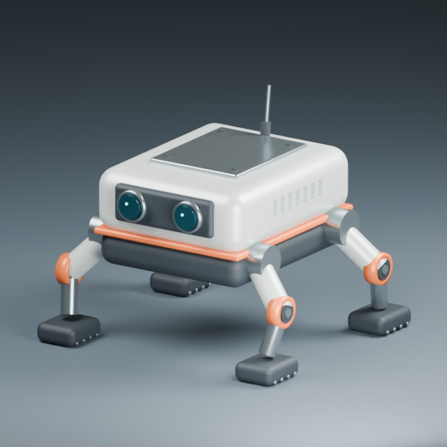
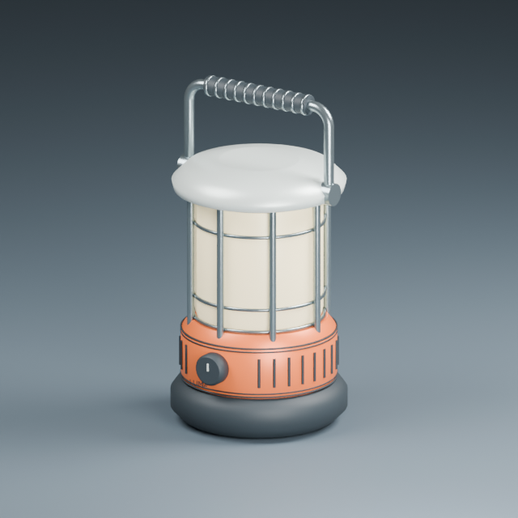
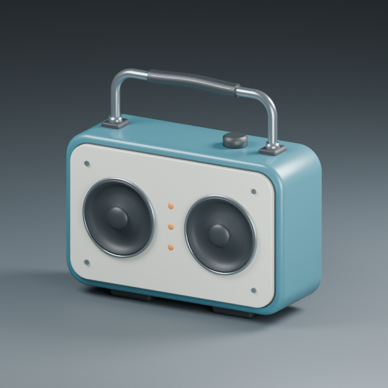
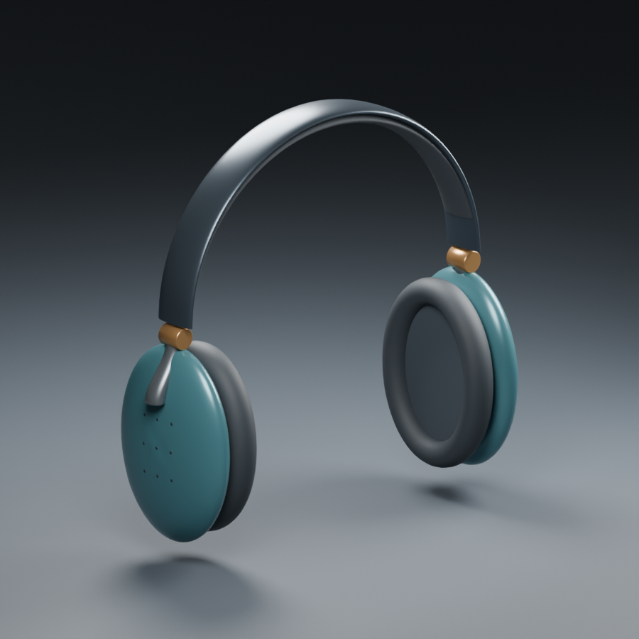
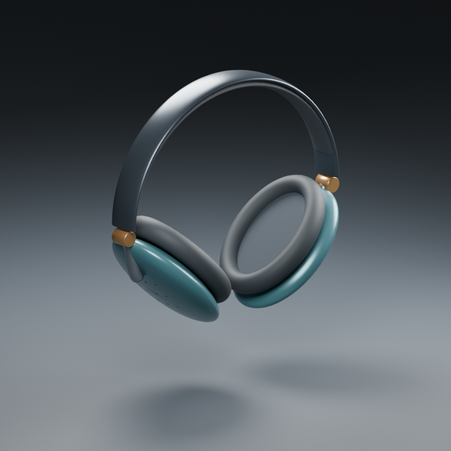

# Mesh Workbench

Coordinate-driven modeling tools that operate **inside Blender**. Inspect render pixels and mesh data, edit vertices and polygons, combine models, and place patterns on surfaces through reproducible JSON recipes or a Python API. No simulated mouse input or external generation service.

Early **0.1.0** implementation. Built for iterative work by people and coding agents, with explicit failure checks and source-preserving operations.

[Documentation index](docs/README.md) ? [Current status](docs/STATUS.md) ? [Next milestones](docs/ROADMAP.md)

## Modeled designs

Actual Blender renders created with this toolkit.

| Field robot | Work lantern |
| --- | --- |
|  |  |
| Ray sculpture | Field speaker |
|  |  |
| Asymmetric mouse | Mouse shell separation |
|  |  |
| Folding headphones | Folded configuration |
|  |  |
| Cordless drill | Separated drill housing |
|  |  |

See the [four-design portfolio and completion audit](docs/studies/PORTFOLIO.md) for model details and reproduction commands, and the [design journal](docs/studies/DESIGN_STUDIES.md) for revisions and evaluation. The [field speaker recipe](examples/field-speaker.json) runs directly through the CLI.

Latest: [local remeshing and cordless drill](docs/studies/DRILL_STUDY.md): feature-pinned edge operations, UV/mask/binding transfer, atomic assembly migration and saved-file follow-up editing.

Previous: [folding headphones](docs/studies/HEADPHONE_STUDY.md): measured surface repair, explicit subdivision correspondence, section-preserving paths and constrained group hinges across three sizes.

Previous: [regenerating mouse assembly](docs/studies/ASSEMBLY_STUDY.md): persisted dependencies, selective updates, atomic rollback and sampled motion checks, demonstrated on three native variants.

Previous: [asymmetric mouse and measured shell study](docs/studies/MOUSE_STUDY.md), including guide lofts, independent local edits, real wall thickness, panel gaps and deformation-following details. Earlier: [reference-driven speaker refinement](docs/studies/PRECISION_STUDY.md).

## Features

- Orthographic render-to-surface maps: world position, geometric normal, depth, object/face IDs, geometry/camera revision checks.
- Coordinate Grab, Pinch, Smooth and signed normal strokes; path interpolation, pressure, edge-distance neighborhoods, masks, X symmetry and independent layers.
- Multiple models: selected `.blend` append; OBJ/STL/PLY/glTF import; transforms; copies; mesh joining; exact booleans; voxel fusion; indexed-topology morph blending.
- Vertex/edge/face selection by indices or world bounds; vertex growth; precise displacement; subdivision, extrusion, inset, bevel, weld, deletion and triangulation.
- Surface projection and conforming; raised seam curves; repeated real mesh motifs; cylindrical UVs and a procedural woven material.
- Dimensioned boxes, revolved profiles, anchored struts, transported section sweeps, local fairing and conforming relief dots through Python and JSON recipes.
- Reference silhouette metrics, named vertex regions, reversible section profiles, cubic handles, bound mesh seams and candidate comparison/restore.
- Asymmetric guide lofts, source-preserving shell partitions, section cuts, wall/gap gauges and native violation markers.
- Persisted assembly recipes, selective regeneration, measured acceptance, atomic failure recovery and discrete rigid-motion interference checks.
- Curvature maps and reflection diagnostics, pinned quadratic surface fitting, explicit triangle-refinement correspondence, measured section paths and absolute group hinges.
- Local triangle remeshing with fixed feature charts, sampled shape-error gates, UV/mask/material/binding correspondence and direct-detail assembly migration.
- Simple materials, mesh diagnostics/export, multi-view capture, saved-file checkpoints and structured failure audits.

Topology edits and combinations create new objects. Deformation layers can be disabled independently. Existing inputs and files are preserved.

## Quick start

Install Blender separately and make `blender` available on PATH, or set `BLENDER_BIN` to its executable.

```sh
python -m pip install -e .
mesh-workbench run examples/assembly.json --output runs/assembly
mesh-workbench inspect runs/assembly/review --pixel 192 192
```

Pixel inspection on the host requires `python -m pip install -e ".[analysis]"`. Official Blender builds include NumPy. Distribution packages may require it separately (Ubuntu: `python3-numpy`). No PyPI `bpy` package is required.

From a checkout without installation:

```sh
PYTHONPATH=src python -m mesh_workbench run examples/polygon-edit.json --output runs/polygon-edit
```

PowerShell equivalent: `$env:PYTHONPATH='src'`. Alternatively use the installed `mesh-workbench` command. Output paths must be new; each run produces `result.blend`, `recipe.json`, `audit.json` and requested captures. Logs are stored beside the run directory.

## Recipes and API

See [operation reference](docs/reference/OPERATIONS.md), [design and limits](docs/reference/DESIGN.md), [validation status](docs/STATUS.md), and the asset-free [examples](examples).

```python
# Inside Blender Python, with this package on sys.path
from mesh_workbench import geometry, models

base = models.primitive('cube', 'Base')
top = geometry.selection(base, 'FACE', box=[[-2, -2, .99], [2, 2, 1.01]])
tower = geometry.edit_topology(base, top, 'extrude', 'Tower', delta=[0, 0, .5])
```

This is an API/CLI toolkit, not a finished interactive sculpting application. The current surface camera is orthographic. Pattern anchor spacing does **not** guarantee collision-free geometry. Blending requires matching vertex correspondence. Topology-changing results require fresh selections/maps/masks. No automatic retopology or animation rigging is claimed.

## Tests

```sh
blender --background --factory-startup --disable-autoexec --python-exit-code 2 --python tests/blender_tests.py
python -m unittest discover -s tests -p "test_*.py"
```

## License

GPL-3.0-or-later; see [LICENSE](LICENSE). No third-party character models, contest references, textures or proprietary assets are bundled. Included examples are generated procedurally by this repository. Blender is a separate dependency; this is an independent project, not an official Blender product.
