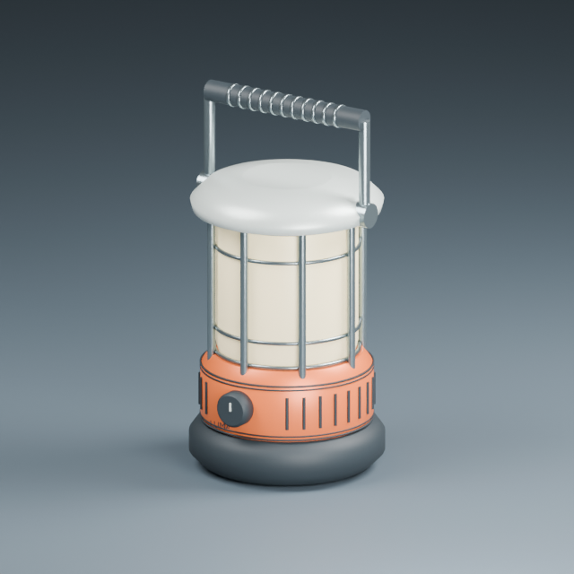
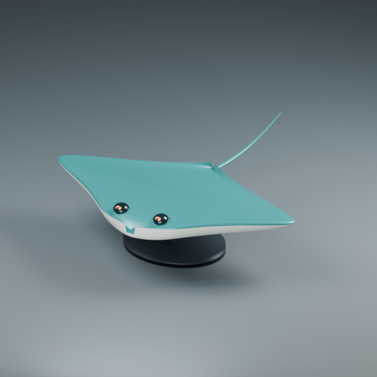
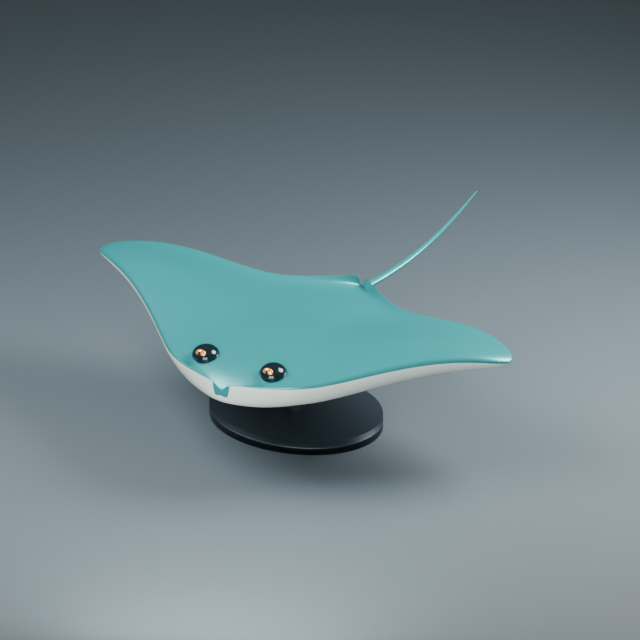
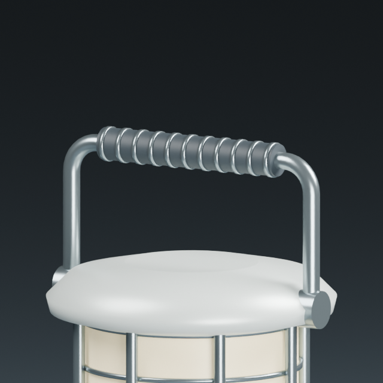
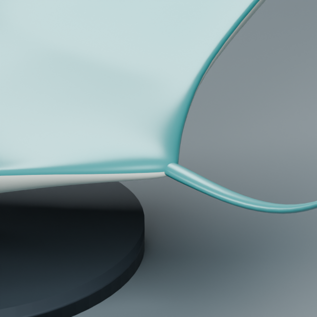
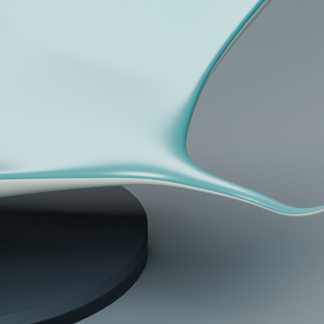
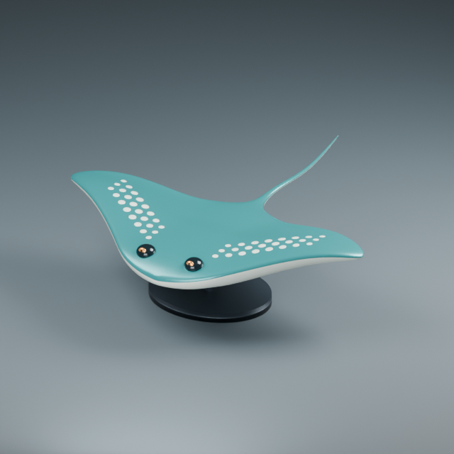
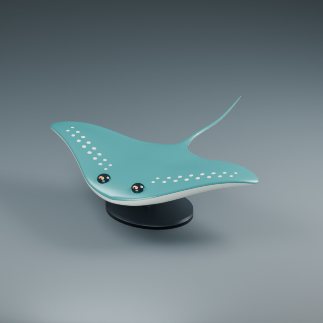
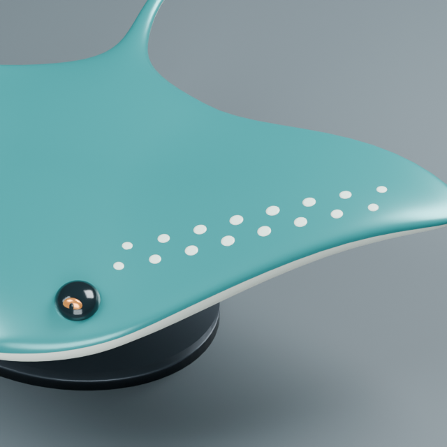

# Design iteration journal

## 2026-10-05: two original product studies

These are static design studies, not mechanically validated products or rigged characters. No outside model, image texture or character reference is used.

Reproduce with a fresh output directory:

```sh
blender --background --factory-startup --disable-autoexec --python-exit-code 2 --python examples/design_studies.py -- runs/design-studies
blender --background --factory-startup --disable-autoexec --python-exit-code 2 --python examples/review_studies.py -- runs/design-studies
```

Each study saves a native editable `model.blend`, front/rear renders and a report. The review reopens each file, checks evaluated meshes, measures a recessed slot and captures paired render/pixel world-coordinate maps. Repeat reviews require removing nothing: use a fresh design run instead. Scripts refuse existing capture folders.

### Field robot


- First render exposed faceted shell corners, visibly empty knee collars and flat dark rectangles standing in for vents.
- Revision increases bevel resolution, weights surface normals, fills the knee with an axle/bolt, cuts 14 actual recesses into the shell and adds a rear service panel with connectors.
- Evaluated result: 71 visible mesh parts, 24,249 vertices. No boundary/nonmanifold edges on those individual evaluated parts. Sampled recess depth: 0.1300001 world units. This is not an assembly collision or load-bearing test.
- Pixel (88,148) in the 320px front map hits the left lens at approximately (-0.50048,-1.50500,1.96492), normal (0,-1,0). Map revisions are stored with each query.
- Visual limits: box-like body, short generic piston legs, weak front lettering contrast, exaggerated bright edge gasket and weak vent contrast in the key light. Parts intersect intentionally at attachment sites; no joint kinematic clearance has been proven. Tread pieces are separate geometry, not yet a continuous molded sole.

### Work lantern



- First render exposed an unbroken lower housing and a visually uniform diffuser.
- Revision adds real circumferential seams and repeated vertical grip ribs, preserving the switch and protective cage.
- Evaluated result: 65 visible mesh parts, 9,320 vertices. No boundary/nonmanifold edges on those individual evaluated parts.
- Visual limits: handle bends are simple overlapping cylinders, top cap shading is soft, lower marking placement remains cramped and the diffuser does not model optical internals. Repeated ribs improve detail but do not alone establish design quality.

### Tools extracted from the exercise

`mesh_workbench.construction` provides:

- `rounded_box(name, dimensions, location, radius, segments=8)`: full dimensions in world units, retained bevel/normal modifiers, scale remains identity.
- `revolve(name, profile, segments=64, closed=False, location=...)`: radius/Z profiles. Open profiles receive planar caps; closed profiles create hollow rings. Positive radii only; simple profiles required. No self-intersection solver.
- `strut(name, start, end, radius, segments=32)`: cylinder endpoints fixed to world-space anchors.

These functions create fresh named objects and reject invalid dimensions, duplicate names, repeated adjacent profile points and coincident anchors. They are Python API functions; JSON recipe dispatch has not yet been added.

Validation: Blender 5.2.2 LTS, eight integration tests and three host CLI tests passed. New coverage checks dimension preservation, anchor placement, ring manifold/positive volume and no object leakage after invalid inputs. Both saved designs passed separate evaluated-mesh review. Front/rear and robot side renders were visually inspected.

## Next evaluation cycle

- Add an organic subject to expose limitations not covered by product assemblies.
- Exercise local shape edits from captured coordinates and record before/after geometry, not just parameter regeneration.
- Replace overlapping handle construction with a reusable swept section tool, then evaluate joins and shading.
- Improve the robot's silhouette and assembly logic; establish comparable detail/side/wire views before judging quality gains.

The broader iterative modeling goal remains active. Passing these checks does not establish expert-level modeling or completion of that goal.

## 2026-10-05: organic ray and tool reuse




Third design family: a stylized ray sculpture on a display stand. Body sections define the planform; the tail uses a tapering curved sweep. This is an original decorative design, not a measured anatomical reconstruction.

### Evidence-led changes

1. Captured the body into a 384 x 384 render/world-position/normal map. Pixel (305,202) corresponds to approximately (1.95078,0.11070,1.19494), on the right wing.
2. First trial used a narrow geodesic Grab. The actual before/after render exposed abrupt wing curvature; 1,474 vertices moved, but visual quality was insufficient.
3. Changed to a broader spherical influence for this thin wing so both sides of its thickness move together. This is a deliberate modeling choice, not a replacement for geodesic selection when nearby disconnected surfaces need protection.
4. Fixed the underside material assignment to use section domains rather than a global height threshold, and reduced the tail-root thickness. A small nose color irregularity and the separate tail junction remain visible.
5. Final reversible symmetric Grab moved 5,966 of 14,850 body vertices. Maximum displacement was 0.3042824 world units. A fresh process reopened the saved file, matched the recorded edited arrays, disabled the layer to match the recorded base, and restored the edited state.
6. Central 4,994 vertices remain exactly unchanged. Mirrored displacement error was at most 2.82e-7. Old surface maps were rejected after deformation. Final body is finite with no boundary/nonmanifold edges. These checks do not prove absence of self-intersections.

Reproduce (fresh output):

```sh
blender --background --factory-startup --disable-autoexec --python-exit-code 2 --python examples/organic_study.py -- runs/organic
blender --background --factory-startup --disable-autoexec --python-exit-code 2 --python examples/verify_organic.py -- runs/organic
```

Artifacts include `ray.blend`, before/after/side renders, paired coordinate captures, `deformation.npz`, `report.json` and independent `reopen-verification.json`.

### Reusable sweep tool

`mesh_workbench.sweep.sweep(name, centers, radii, segments=32, reference=(1,0,0))` creates a capped open-path mesh from elliptical sections. A transported frame avoids choosing a new orientation independently at each section. Geometry is in world coordinates. The initial reference must not be parallel to the first tangent; radius pairs must be positive; repeated centers and nearly reversing paths are rejected before creating an object. Triangulated end caps expose editable face domains.

This tool does not interpolate/smooth the supplied path, support closed paths or solve self-intersection. Tight bends need adequate samples and sufficiently small section radii. It is currently a Python API, not a JSON operation.

### Reused on the earlier lantern



The earlier handle had overlapping straight rods. The same sweep tool now creates a continuous tube through two rounded corners, with a separate shorter grip. Native Blender geometry and the close-up render were checked. The handle mesh has no nonmanifold edges. The mechanical hinge and manufacturing clearance remain unvalidated.

```sh
blender --background --factory-startup --disable-autoexec --python-exit-code 2 --python examples/refine_lantern.py -- runs/design-studies/work-lantern/model.blend runs/lantern-refined
```

Validation: nine Blender integration tests passed on Blender 5.2.2 LTS after the final cap change. The new test measures every section center and minimum/maximum radius, verifies frame orthogonality, manifoldness and positive signed volume, and checks failure cases leave the scene unchanged. The prior product-study commit also passed Linux CI: https://github.com/shakystar/mesh-workbench/actions/runs/37279692223 .

### Evaluation and remaining work

The organic study now proves a render-to-coordinate-to-local-edit cycle on an actual design, including persistent reversible state. It remains visually simple: the body is broad and flat, face detail is minimal, and the tail is a separate overlapping part. No expert likeness, rig or production-ready topology is claimed. The previous journal's organic-study and continuous-handle tasks have progressed; next work should address continuous organic junctions, reusable local detail patterns and comparable geometric/visual review before expanding the design count further.

## 2026-10-05: continuous organic junction and failure-driven validation

The earlier manifold-only checks missed defective geometry. The old ray body (`organic-03`) produced 328 nonadjacent triangle-overlap candidates and an empty result from the default Exact Boolean union. A positive signed volume and zero nonmanifold edges had not detected this problem.

The narrow end sections inherited the same camber amplitude as the wide wings. Scaling camber down with section width eliminated the detected overlaps in the rebuilt body; the tail also tested at zero. Default Exact union then produced a single connected mesh. The Boolean tool now rejects an empty UNION and cleans up the failed result rather than reporting success.

### Two junction designs compared




1. **Exact union plus local fairing:** structurally connected the pieces, retaining the original inputs. Three stronger smoothing candidates introduced nonadjacent overlap candidates and were rejected with coordinate/key/history rollback. The accepted weak candidate moved vertices at most 0.00007725 units, which had negligible visual benefit. This is retained as a tool-validation example, not presented as a successfully rounded transition.
2. **Continuous section design:** extended the body sweep through the tail with a gradual taper. The actual close-up shows a continuous transition instead of an attached cylinder. Initial asymmetric root controls propagated a small asymmetry toward the wing; aligning the root controls before the tail bend restored the required wing-edit symmetry. This is the preferred design.

The final continuous design has 18,946 vertices, 18,944 faces and one connected component. Boundary/nonmanifold edge counts and nonadjacent triangle-overlap candidates are zero. The coordinate Grab changes 5,964 vertices; the middle 6,090 vertices remain unchanged. A fresh Blender process matched saved edited and base arrays and verified mirrored edit error below 2.82e-7. This is still a decorative static mesh without anatomical or rigging validation.


Recommended reproduction:

```sh
blender --background --factory-startup --disable-autoexec --python-exit-code 2 --python examples/organic_study.py -- runs/organic-continuous --continuous
blender --background --factory-startup --disable-autoexec --python-exit-code 2 --python examples/verify_organic.py -- runs/organic-continuous
```

The separated-part comparison remains available by omitting `--continuous`. The join experiment accepts that saved file:

```sh
blender --background --factory-startup --disable-autoexec --python-exit-code 2 --python examples/refine_ray.py -- runs/organic/ray.blend runs/join-review
blender --background --factory-startup --disable-autoexec --python-exit-code 2 --python examples/verify_join.py -- runs/join-review
```

### Tools improved by the failed candidates

- `fairing.region(obj, center, radius, iterations=8, positive=0.5, negative=-0.53)` applies paired Laplacian passes through a smooth spherical weight in an independent layer. Mesh boundaries and out-of-radius vertices are pinned. It reduces ordinary smoothing shrink but does not preserve volume exactly. Inputs with nonadjacent overlap candidates are rejected. If the edited result introduces candidates, the layer is removed and prior coordinates, keys and history survive. It does not use vertex-group masks.
- `fairing.components(obj)` reports evaluated connected-component sizes, exposing joins that are only multiple meshes in one object.
- `fairing.overlap_candidates(obj)` checks evaluated triangles through a BVH, excluding pairs sharing a vertex. Zero candidates is not a proof of no self-intersection: adjacent-triangle folds, numerical tolerances and pathological solids need stronger checks.
- `models.boolean(..., 'UNION', ...)` now rejects an empty result and removes orphan output data on failure. Empty DIFFERENCE/INTERSECT results remain legal.

Validation on Blender 5.2.2 LTS: ten integration tests passed. New coverage checks local noise reduction, pinned boundaries, reversible layers, invalid inputs, component counts and a known pair of crossing triangles. Separate saved-file tests verified the accepted join and rollback of the known failing strong edit, plus the preferred continuous design. The prior sweep/organic commit passed Linux CI: https://github.com/shakystar/mesh-workbench/actions/runs/37281114724 .

Remaining work: richer deliberate surface detail, stronger adjacent-face/intersection diagnostics and quality comparisons beyond topology counts. The connected ray is an improvement in construction and silhouette, not a completed character-production pipeline. Goal remains active.

## 2026-10-05: conforming relief pattern study




Two surface designs were modeled as actual closed geometry on the continuous ray: 48 larger spots and 32 smaller spots. The sparse version was selected after viewing the full model because it preserves more uninterrupted wing surface. This is a design judgment, not a numerical quality score or anatomical claim.

### Defect found and corrected

The first close-up showed nibbled spot edges. Testing only face centers missed the defect: all 2,304 sparse top-face centers were above the body, but six of 4,608 top-edge midpoints were below it, by up to 0.00004166 world units. The top clearance was increased from 0.0001 to 0.0005, and the construction tool now validates vertices, edge midpoints and face centers before creating the output object.



Fresh-process saved-file verification checked 13,872 probes on the dense design and 9,248 on the sparse design. Minimum signed sampled clearance was respectively 0.00031427 and 0.00035797. Independent conservative bounding-sphere gaps were at least 0.063276 and 0.100889. Each motif is a closed component, with zero nonmanifold edges and no nonadjacent overlap candidates in the relief object. Body coordinates match the source exactly, and the source file hash is unchanged.

The dark/white objects do not form one booleaned mesh: bottom faces intentionally enter the ceramic body, providing separate editable relief pieces. The top-probe check is sampled, not a continuous triangle-surface collision proof. Larger, coarser patches on curved surfaces are rejected and need more samples or greater clearance. Rebuild motifs after changing the target geometry; they do not automatically follow later edits.

### Reusable tool and reproduction

`relief.dots(target, points, name, radii=.04, height=.004, embed=.002, segments=24, rings=3, max_distance=1, direction=None, gap=.005, clearance=.0005)`:

- Projects anchors and every section vertex onto the evaluated target.
- Builds tapered upper surfaces, embedded lower surfaces and closed side walls.
- Supports a different radius for each anchor.
- Rejects missed/steep footprints, insufficient sampled top clearance and overlapping motif bounding spheres before committing scene objects.
- Preserves the target geometry. Outputs are world-space static meshes with identity object transforms.

This is currently a Python API; the new construction tools still need consistent recipe dispatch and broader cross-version example coverage.

```sh
blender --background --factory-startup --disable-autoexec --python-exit-code 2 --python examples/relief_study.py -- runs/organic-continuous/ray.blend runs/relief
blender --background --factory-startup --disable-autoexec --python-exit-code 2 --python examples/verify_relief.py -- runs/organic-continuous/ray.blend runs/relief
```

`dense.blend` and `sparse.blend` retain editable motifs and the original body. Both have whole/detail renders and an independent `reopen-verification.json`.

Validation: eleven Blender integration tests passed on 5.2.2 LTS. The added test verifies planar thickness, closed components, exact target preservation, missed footprints, too-close anchors, rejection of an under-resolved curved patch and acceptance of a sufficiently resolved patch. Previous junction-tool commit passed Linux CI: https://github.com/shakystar/mesh-workbench/actions/runs/37283321666 .

Remaining visual limits: repeated rows are deliberately regular, with no asymmetrical hand-painted variation, microtexture or underside detail. The next tool integration should make these operations accessible through the same recipe interface and preserve projection checks during reuse on changed geometry. Goal remains active.
