# Asymmetric mouse: six-milestone completion audit

An original 124 mm mouse study demonstrates guide-based asymmetric surfaces, local undo layers, closed shell partitions and measured wall/gap checks. This is an authored design, not a product scan or validated ergonomic device.

| Baseline | Refined assembly |
| --- | --- |
| 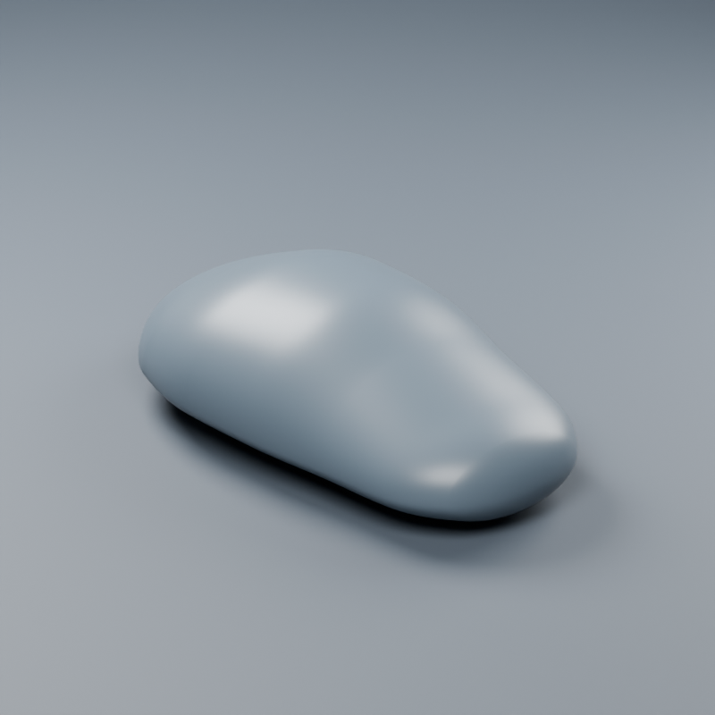 | 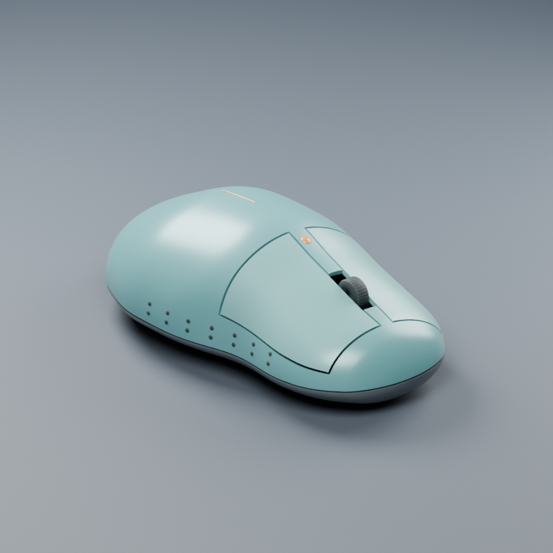 |

## Frozen target and requirements

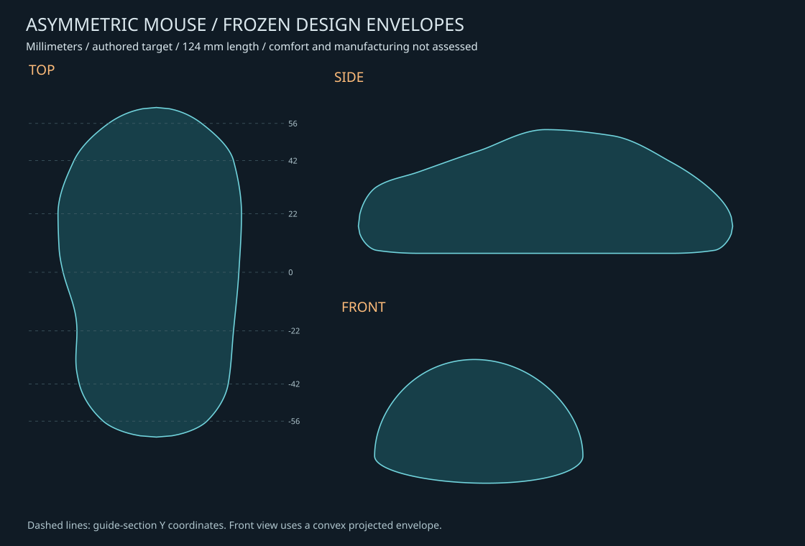

The [brief](../examples/mouse-target.json) was saved before modeling. Nine Y sections define left/right widths, crown and underside; a specified local field defines the thumb recess. [Drawing polygons](../examples/mouse-reference.json) were derived before candidate meshes were built, using [the reference-freezing script](../examples/freeze_mouse_reference.py). They are mathematical design envelopes, not independent measurements of a real product. The front envelope is convex; the top/side drawings retain longitudinal concavity.

- Length 124 mm; asymmetric widths and a 43 mm crown guide.
- Fixed-view silhouette IoU >= 97%; guide-section bound error <= 0.65 mm.
- Nominal wall 1.6 mm; sampled opposite-skin distance 1.35..1.9 mm.
- Nominal trim gap 0.7 mm; sampled outer-boundary gap 0.45..1.05 mm.
- Unselected vertex error <= 1e-5 mm; closed parts; source-preserving edits; reopen verification.

Brief hash: `e9e9f0c5a301c31430703f883e01a061050216ee0372a217fdb7e5972607cb7a`.

## Milestone evidence

| Milestone | Implemented result | Evidence |
| --- | --- | --- |
| 1. Freeze target | Dimensions, sections, local field and acceptance fixed before candidate construction | Brief and drawing JSON with hashes |
| 2. Connected curves | Asymmetric guide loft with shape-preserving cubic interpolation and controlled pole sampling | Three-view masks and seven actual triangle/plane sections |
| 3. Local editing | Separate thumb and palm regions with additive shape-key layers | Thumb retained; raised-palm candidate rejected and left disabled; fresh-process undo and outside-region checks |
| 4. Shell partition | Upper housing, base and two button shells; real wheel opening | 33,928 wall probes, 2,916 outer-gap probes, ten cross-object intersection checks |
| 5. Surface detail | Fourteen conforming grip motifs and a bound crown line | Grip anchors move 2.872 mm; 1,806 final-housing clearance probes; crown line regenerates after palm edit |
| 6. Final delivery | Before/after, orthographic and exploded renders; editable native file; reusable Python and JSON tools | Saved-file audit, integration tests and CLI run |

## Geometry and visual result

| Baseline top | Final top |
| --- | --- |
| 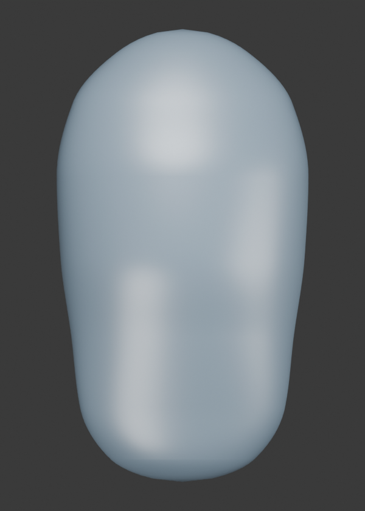 | 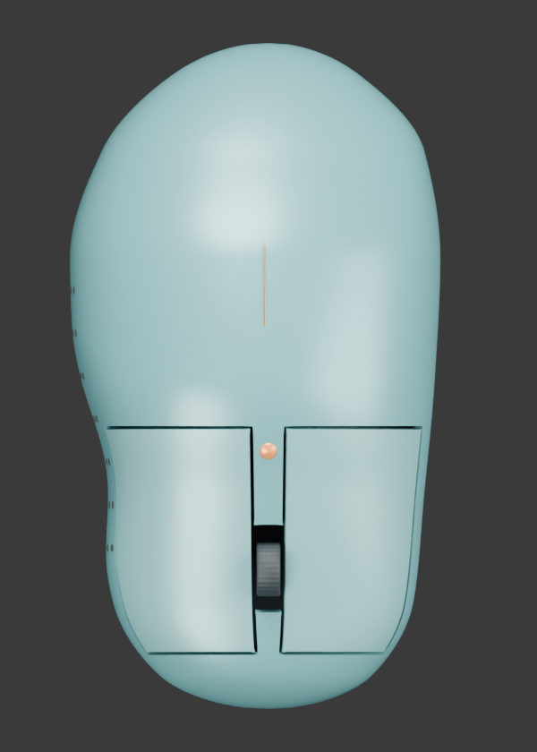 |
| 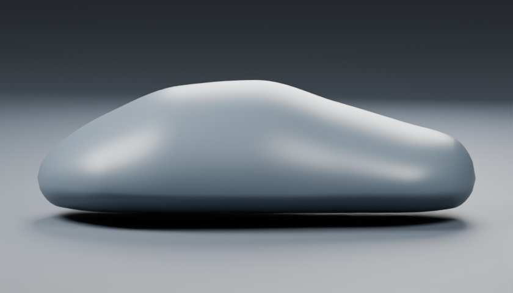 | 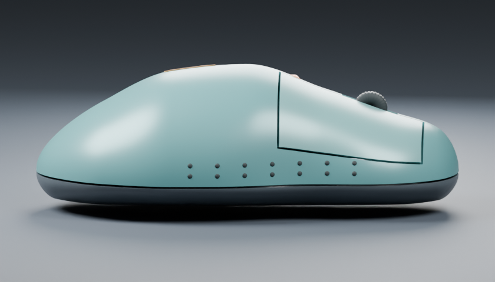 |

The retained form has an asymmetric crown and thumb indentation. Split buttons follow the master surface. The lower shell is hollow and separate; the wheel enters an actual opening. Grip motifs are real closed meshes. The last sampling revision removes the visibly angular nose/tail of the earlier uniform-row model.

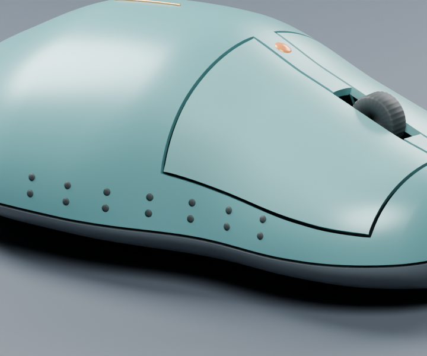

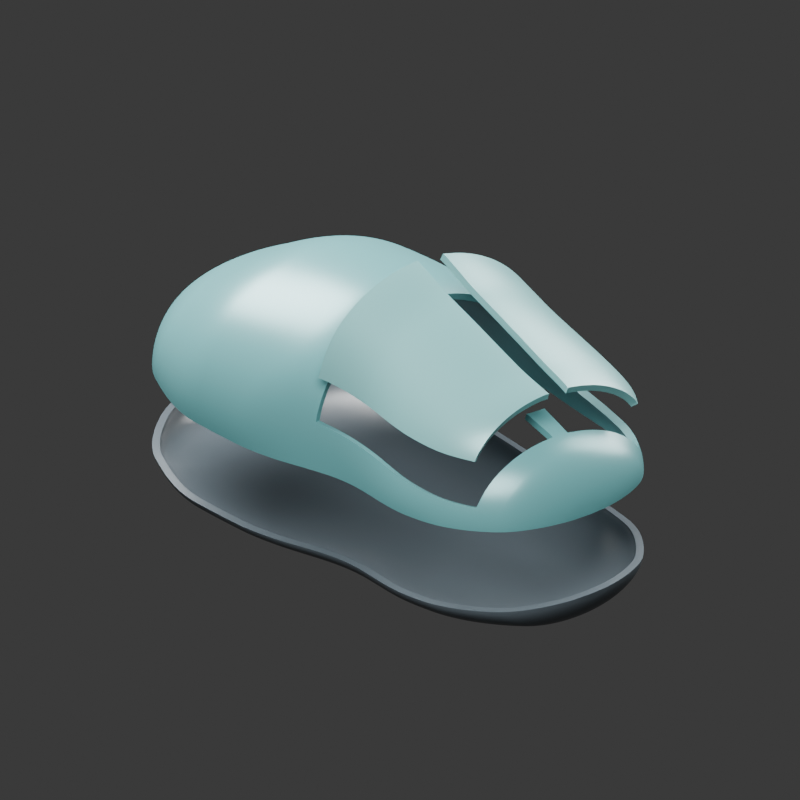

## Candidates and target error

| Candidate | Mean master silhouette IoU | Max guide-section bound error, mm | Selection |
| --- | ---: | ---: | --- |
| baseline | 90.054% | 4.479454 | rejected |
| guided | 99.653% | 2.115856 | rejected |
| raised-palm | 99.579% | 1.658456 | rejected |
| refined | 99.958% | 0.005344 | accepted |

The guided candidate has high silhouette overlap but fails the section constraint. The raised-palm layer also fails the frozen target and remains available, disabled. Candidate ranking now accepts an explicit constraint-violation count in addition to silhouette and geometry checks.

| View | Baseline master | Refined master | Final split shells |
| --- | ---: | ---: | ---: |
| top | 95.370% | 99.972% | 99.940% |
| side | 89.794% | 99.952% | 98.490% |
| front | 84.998% | 99.952% | 98.430% |

The final split-shell measurement includes intentional trim gaps and the wheel opening but excludes the wheel, motifs and accent. Its lowest IoU still exceeds the frozen 97% requirement. Boundary distances on this assembly include internal gap boundaries, so they must not be interpreted as outer-outline error. These are sampled drawing comparisons, not a general perceptual likeness score.

| Top assembly discrepancy | Side assembly discrepancy |
| --- | --- |
| 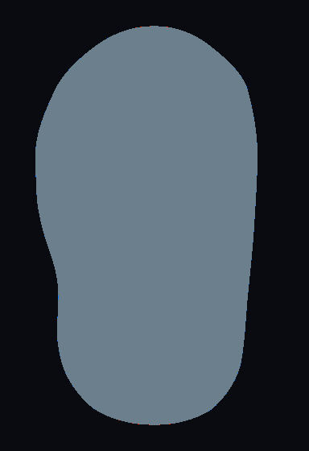 | 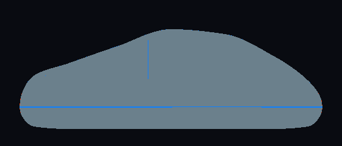 |

Gray: agreement; orange: excess; blue: missing (including intended openings).

## Walls, gaps and rejected work

Final nearest opposite-skin measurements: **1.59334..1.59997 mm**, 33,928 triangle-centroid probes, zero misses. Outer trim gaps: **0.50864..0.70000 mm**, 2,916 bidirectional endpoint/midpoint probes. Four shell objects and the wheel have zero cross-object triangle-intersection candidates over all ten pairs. All eight visible model mesh objects are closed and have zero nonadjacent self-overlap candidates.

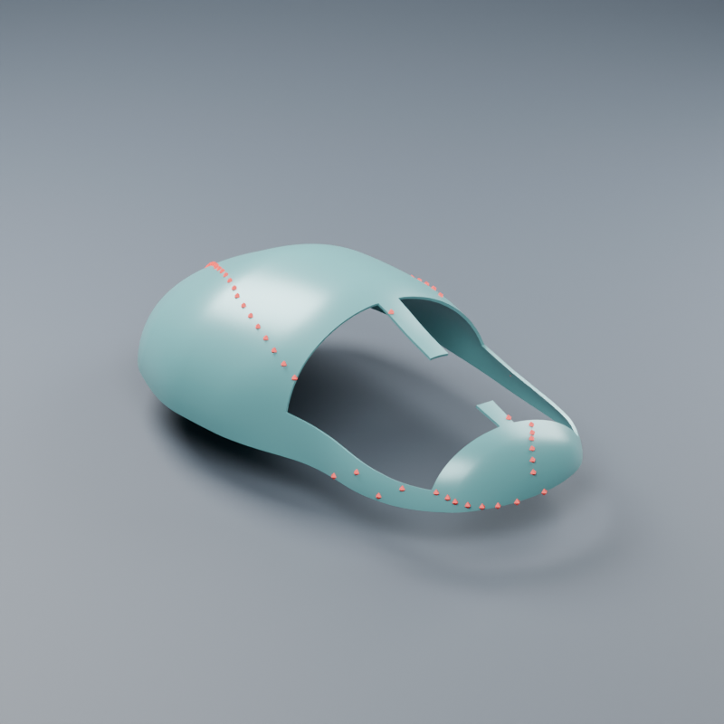

The deliberately thin 0.7 mm shell fails the unchanged wall limits. The red native mesh markers show a bounded sample of offending coordinates; the local full report retains every violation.

Development failures were retained in ignored runs and changed the tools:

1. Moving only boundary vertices inverted narrow trim cells. A geodesic collar now spreads the motion; projection updates offset normals. Reversed outer edges/cells fail before output creation.
2. Face-normal rays near finite rims can leave through the side rather than reach the inner skin. Both methods remain available. Final acceptance uses **nearest opposite-skin distance**, which measures actual inner mesh geometry and is conservative relative to normal-ray lengths. The final normal-ray diagnostic is **not a pass**: it retains 49 misses (2 upper, 47 lower). No misses were discarded from that diagnostic, and no thickness thresholds were relaxed. The method is recorded in every report.
3. Pure cosine pole sampling first exposed duplicate floating-point guide rows, then folded some offset interiors. Guide snapping removes duplicate rows. A controlled 0.75 blend was selected after comparison; offset overlaps now reject and delete only the new output. The failing pure-cosine case is a regression test.
4. A lower-resolution CLI example also triggered the offset guard. The published recipe uses the verified 128-row/128-angle settings with 0.75 end refinement.

These are finite sampled checks. They do not prove a continuous minimum wall, complete collision freedom, moldability or mechanical function. Gap measurements cover corresponding outer trim boundaries, not every possible internal clearance. Triangle-crossing checks do not detect one closed object wholly contained inside another without crossings.

## Reopen verification

A fresh Blender process verifies saved coordinate arrays, target hashes and regenerated numerical measurements. **15,646 vertices outside the thumb region remain unchanged; undo error is zero.** The independent palm layer preserves vertices outside its own region and restores exactly. A new bound crown line follows that palm change by up to 1.812 mm while preserving the old line.

Grip anchors shift by up to 2.872 mm with the thumb recess. Top vertices, edge midpoints and face centers were checked against the final upper housing, not just the hidden master: 1,806 probes, minimum signed clearance **0.07644 mm**. Pattern bottoms intentionally embed. Candidate visibility restoration and the native file hash are verified.

Local validation: Blender 5.2.2 LTS on Windows, **19 Blender tests and 3 host tests**. The standard CLI completes `examples/mouse-shell.json`, including real capture and gauge reports. [Machine-readable completion evidence](MOUSE_AUDIT.json) includes all candidate, geometry and reopen summaries.

Native result: `runs/mouse-study-08/mouse.blend`. The hidden master retains editable thumb/palm layers; shell outputs are independent snapshots. After changing the master, explicitly regenerate shells and refresh bound details; this is not an automatically updating CAD feature tree.

## Reproduce

```sh
# Complete modeling study and real renders; output must be new.
blender --background --factory-startup --disable-autoexec --python-exit-code 2 --python examples/mouse_study.py -- runs/mouse-new
blender --background --factory-startup --disable-autoexec --python-exit-code 2 --python examples/verify_mouse.py -- runs/mouse-new

# Smaller public entry point through the ordinary CLI.
mesh-workbench run examples/mouse-shell.json --output runs/mouse-shell-new
```

The frozen drawing is checked in. To derive an additional copy without reading candidate geometry, run `freeze_mouse_reference.py -- NEW_REFERENCE_JSON` in factory Blender; it refuses to overwrite a target. Geometry-only iteration is available as an extra `--geometry-only` argument to the study, but it does not provide the required render deliverables.

[Tool operations](OPERATIONS.md#guide-lofts-and-measured-shells). Real comfort, internals, switches, fastening, sensor mounting, travel stops and manufacturing validation remain outside this modeling study. The sharp button corners and simple finish are visible design limitations, not validated production details.
