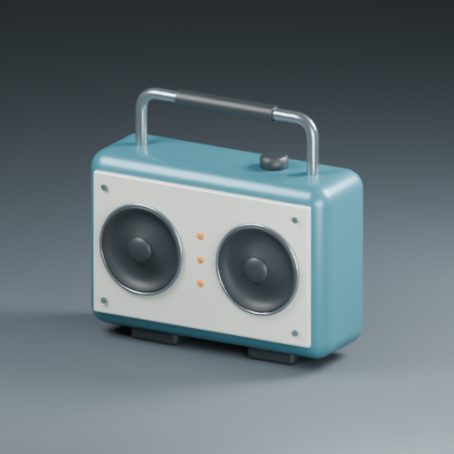

# Four-design portfolio

All images below are actual Blender renders from included procedural examples. Native editable files were reopened during the final audit. No external character models or generated raster substitutes are included.

| Field robot | Work lantern |
|---|---|
|  |  |
| Rounded shells, recessed vents and articulated assembly study. | Revolved housing, protective cage and continuous swept handle. |

| Ray sculpture | Field speaker |
|---|---|
|  |  |
| Continuous organic form, reversible coordinate edits and conforming motifs. | 70-operation JSON construction with driver profiles, service panel and real vent cuts. |

## Audit against the requested objective

> 여러 디자인을 시도해보고 스스로 평가하며 필요한 도구는 개발하면서 스스로 진화하라.

| Requirement | Verified result |
|---|---|
| Try multiple designs | Four distinct original models, native files, full/detail renders and executable sources. |
| Evaluate the work | Before/after visual review and measured failure cases: shell faceting, empty joint collars, overlapping handle parts, ray end-cap overlaps, weak junction smoothing, relief-edge penetration and stale motifs after deformation. |
| Develop tools as needed | Dimensioned construction, transported section sweeps, reversible local fairing, overlap/component diagnostics, conforming reliefs, persistent surface attachments and shared recipe dispatch. |
| Improve the working process | Failed candidates are retained in the journal; empty unions are rejected; unsafe fairing rolls back; reliefs validate sampled clearance; changed topology invalidates attachments. New tools were reused across models. |
| Deliver usable work | Public GPL repository, Python/JSON interfaces, executable examples, operation documentation, native local models and tested recovery paths. |

The requested modeling/evaluation/development cycle is complete. The code remains an early toolkit: automatic retopology, animation rigs, continuous collision proofs and manufacturing validation remain outside the verified capabilities.

## Final native-file check

| Design | Visible model mesh objects | Evaluated vertices | Nonmanifold edges | Nonadjacent overlap candidates |
|---|---:|---:|---:|---:|
| Field robot | 71 | 24,249 | 0 | 0 |
| Work lantern | 64 | 9,960 | 0 | 0 |
| Ray sculpture | 10 | 26,702 | 0 | 0 |
| Field speaker | 26 | 10,576 | 0 | 0 |

Studio floors are excluded. Disconnected designed parts are counted separately. Overlap counts are per object and exclude triangles sharing vertices; this is not an assembly-intersection certificate. File hashes and sizes are in [PORTFOLIO_AUDIT.json](PORTFOLIO_AUDIT.json). Full local per-part data is retained under `runs/portfolio-audit.json`.

Final implementation [CI passed](https://github.com/shakystar/mesh-workbench/actions/runs/37288030843): 15 Blender integration tests and 3 host tests. Windows native studies used Blender 5.2.2 LTS; CI also exercised the integration suite on the distribution Blender in Ubuntu 24.04. Saved-file checks additionally verified detail clearances, material/visibility persistence, shape-key rollback and attachment regeneration after pose undo.

## Reproduce the portfolio

Run from the checkout after installing the package and Blender. Use fresh output directories. `BLENDER_BIN` or the CLI `--blender` option can specify the executable when it is not on PATH.

```sh
blender --background --factory-startup --disable-autoexec --python-exit-code 2 --python examples/design_studies.py -- runs/design-studies
blender --background --factory-startup --disable-autoexec --python-exit-code 2 --python examples/refine_lantern.py -- runs/design-studies/work-lantern/model.blend runs/lantern-refined
blender --background --factory-startup --disable-autoexec --python-exit-code 2 --python examples/organic_study.py -- runs/organic-continuous --continuous
blender --background --factory-startup --disable-autoexec --python-exit-code 2 --python examples/relief_study.py -- runs/organic-continuous/ray.blend runs/relief
mesh-workbench run examples/field-speaker.json --output runs/speaker
blender --background --factory-startup --disable-autoexec --python-exit-code 2 --python examples/audit_studies.py -- examples/studies-manifest.example.json runs/portfolio-audit-new.json
```

Further visual comparisons, rejected candidates and design-specific limitations are retained in the [design journal](DESIGN_STUDIES.md). Detailed operations are in the [recipe reference](OPERATIONS.md).
