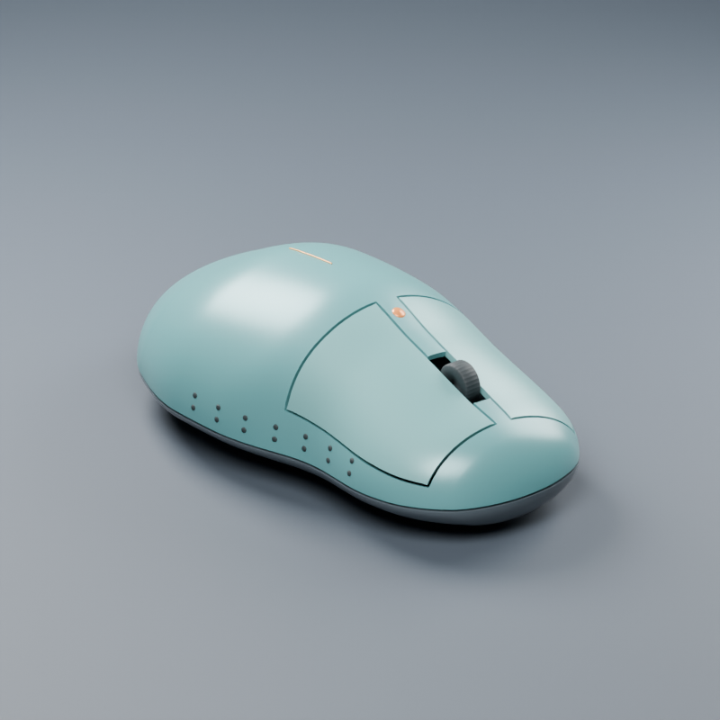
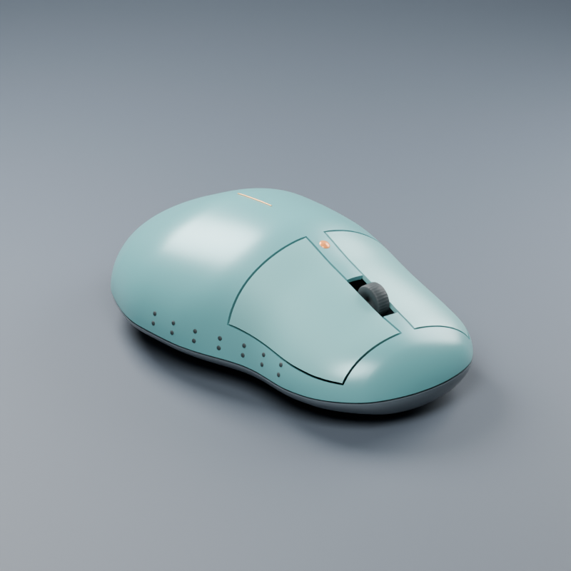
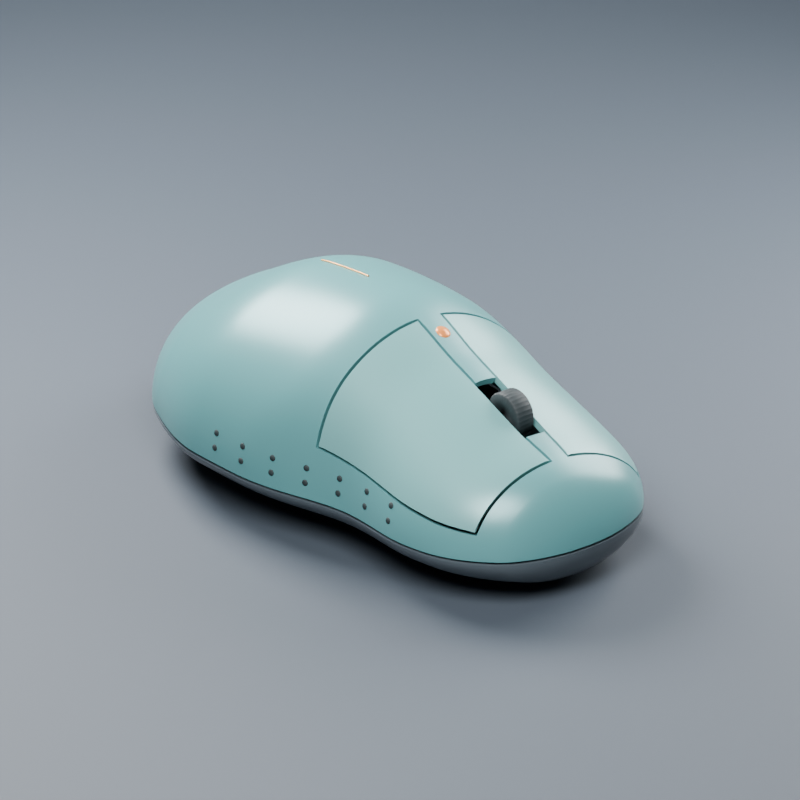
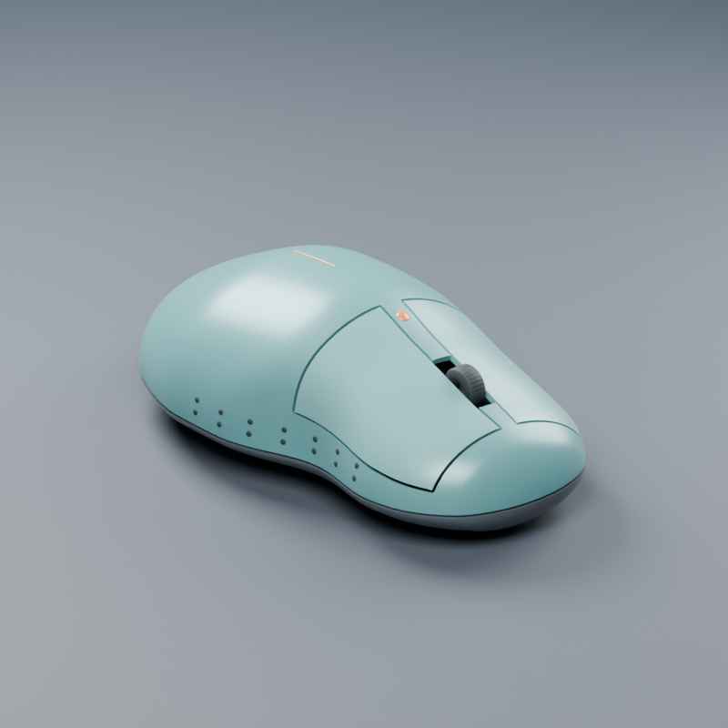

# Regenerating a measured mouse assembly

The mouse master now drives shell partitions, surface details and a rigid wheel through a persisted dependency graph. One update stages affected objects, measures their geometry, and commits them together. Invalid updates leave the existing assembly intact.

| Before | Width +6 mm |
| --- | --- |
|  |  |
| Height +4 mm | Thumb recess +2 mm peak |
|  |  |

These are native Blender renders with identical camera and lighting. No generated illustration replaces the model. The thumb change is a normalized **2 mm peak displacement** into the left flank; it is not a claim about human fit or a uniform 2 mm offset across the region.

## Milestones and evidence

| Milestone | Verified result |
| --- | --- |
| Persist dependencies | Nine nodes, recipes, bindings, topology and revision hashes survive native-file reopening. Missing references, cycles and external edits are rejected. |
| Selectively regenerate | Width and height regenerate all eight derived parts. The thumb edit regenerates upper/lower shells, left button and grip; right button, DPI button, crown accent and wheel retain their geometry. |
| Preserve design constraints | Every variant passes 19 checks: four wall gauges, three gap gauges, two relief clearances, ten shell/wheel pair overlap checks. |
| Atomic failure recovery | A 65 mm narrowing is rejected for reversed trim geometry. Mesh pointers, exact coordinates, transforms, materials/properties, visibility, object inventory and graph are preserved. Tests also inject failure during commit and retain measured thin-wall violation positions. |
| Inspect motion | Left button translation and one full wheel rotation are sampled; failures and affected triangles are reported and original transforms restored exactly. |
| Produce/reopen variants | Three native files are reopened independently, coordinates compared to saved arrays, all constraints remeasured, and another local update successfully executed. Files remain unchanged on disk. |

## Measurements

| Variant | Master width / length / height (mm) | Sampled wall range (mm) | Sampled seam gap range (mm) |
| --- | --- | --- | --- |
| Width | 75 / 124 / 40.994 | 1.59335?1.59997 | 0.50822?0.70000 |
| Height | 69 / 124 / 44.994 | 1.59427?1.59996 | 0.50550?0.70000 |
| Thumb | 69 / 124 / 40.994 | 1.59334?1.59999 | 0.50864?0.70000 |

Acceptance limits stay at 1.35?1.90 mm walls and 0.45?1.05 mm gaps. Wall measurement uses nearest opposite-skin distance at outer triangle centroids, as in the preceding [mouse study](MOUSE_STUDY.md); it is not a proof of continuous minimum wall or rim thickness. Grip top minimum sampled clearance stays above 0.074 mm against the **split upper shell**.

All three variants pass a 0.15 mm button translation sampled every 0.0125 mm. The longer 0.6 mm trial, sampled every 0.05 mm, first detects overlap at 0.55 mm. That is the first sampled failure, **not an exact maximum usable stroke**. A full wheel rotation passes 32 intervals of 11.25 degrees. These are rigid paths; no hinge, spring, switch mechanics or production-ready mechanism is asserted. A positive sampled vertex distance can coexist with an intersecting triangle pair, so overlap candidates independently fail the pose.

Motion checks do not guarantee continuous collision avoidance or detect every complete-containment case. Preview positions identify intersecting triangle centers and clearance probes, not exact contact points. The local `reopened-motion.json` retains these locations.

## Reproduce

From the repository root, with Blender available on PATH:

```sh
blender --background --factory-startup --disable-autoexec --python-exit-code 2 --python examples/mouse_study.py -- runs/mouse-base
blender --background --factory-startup --disable-autoexec --python-exit-code 2 --python examples/assembly_mouse.py -- runs/mouse-base/mouse.blend runs/assembly-mouse
blender --background --factory-startup --disable-autoexec --python-exit-code 2 --python examples/verify_assembly_mouse.py -- runs/assembly-mouse
mesh-workbench run examples/assembly-basic.json --output runs/assembly-cli
```

Each output directory must be new. The native outputs are `width/model.blend`, `height/model.blend`, and `thumb/model.blend`. This verification used `runs/assembly-mouse-04`; generated runs are ignored, and the [public audit](../audits/ASSEMBLY_AUDIT.json) records file hashes and measurements. The source mouse file hash remains unchanged.

Python and JSON interfaces are described in [operations](../reference/OPERATIONS.md#persisted-assemblies-and-motion-inspection). The system updates explicitly through the tool; it does not install handlers, add-ons or global preferences. Only static meshes with stable indexed topology are supported. Previously committed geometry remains in hidden revision objects; source edits retain deformation layers.

## Validation and development findings

Windows Blender 5.2.2 LTS: 23 integration tests and 3 host tests pass; the real host CLI example completes. An additional focused test verifies structured CLI rejection reports after the final audit change. Fresh-process reopen and follow-up editing pass for all three models. [Linux CI](https://github.com/shakystar/mesh-workbench/actions/runs/37318519975) passes all 23 integration and 3 host tests with Blender 4.0.2 on implementation commit `ae3be01553c984cefebbbb58e4cf7261c97f8c1c`. All six milestones are complete.

Earlier trials are retained locally. The first exposed invalid evaluated-mesh lifetime handling. A later reopen check caught a tiny wheel-coordinate change caused by matrix decomposition during motion restoration; restoring the original transform channels fixes it, with exact-coordinate regression coverage. The final reopened files pass the same revision checks used before editing.
