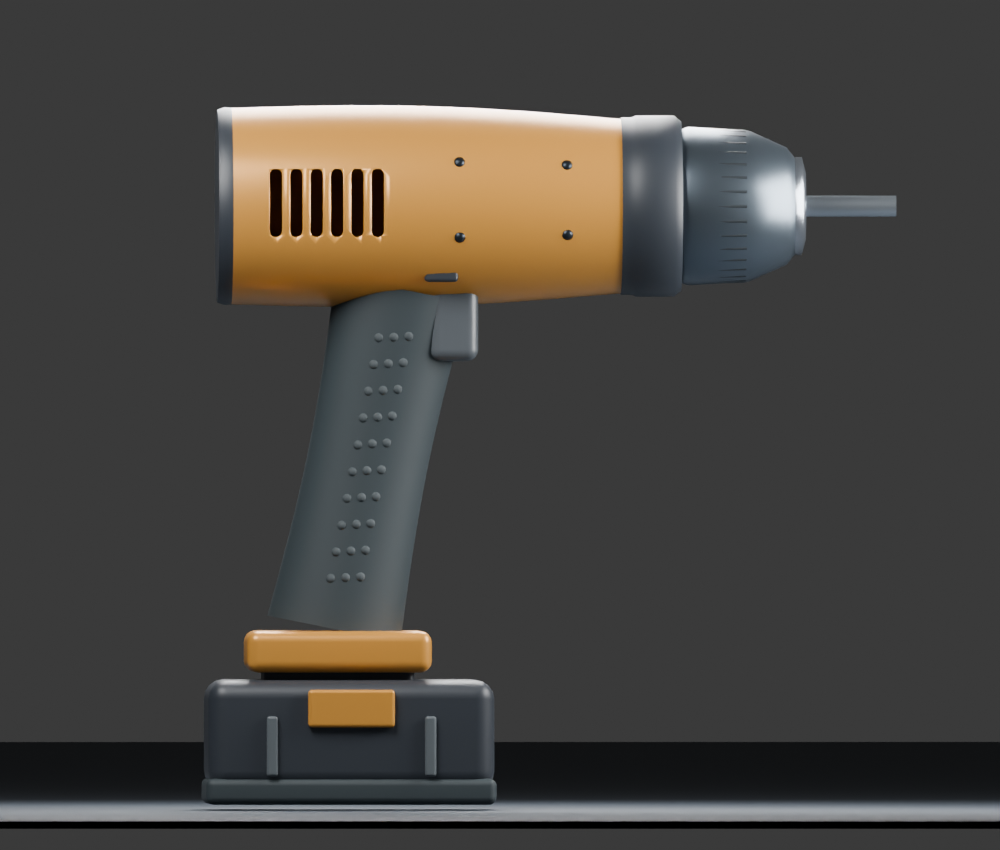
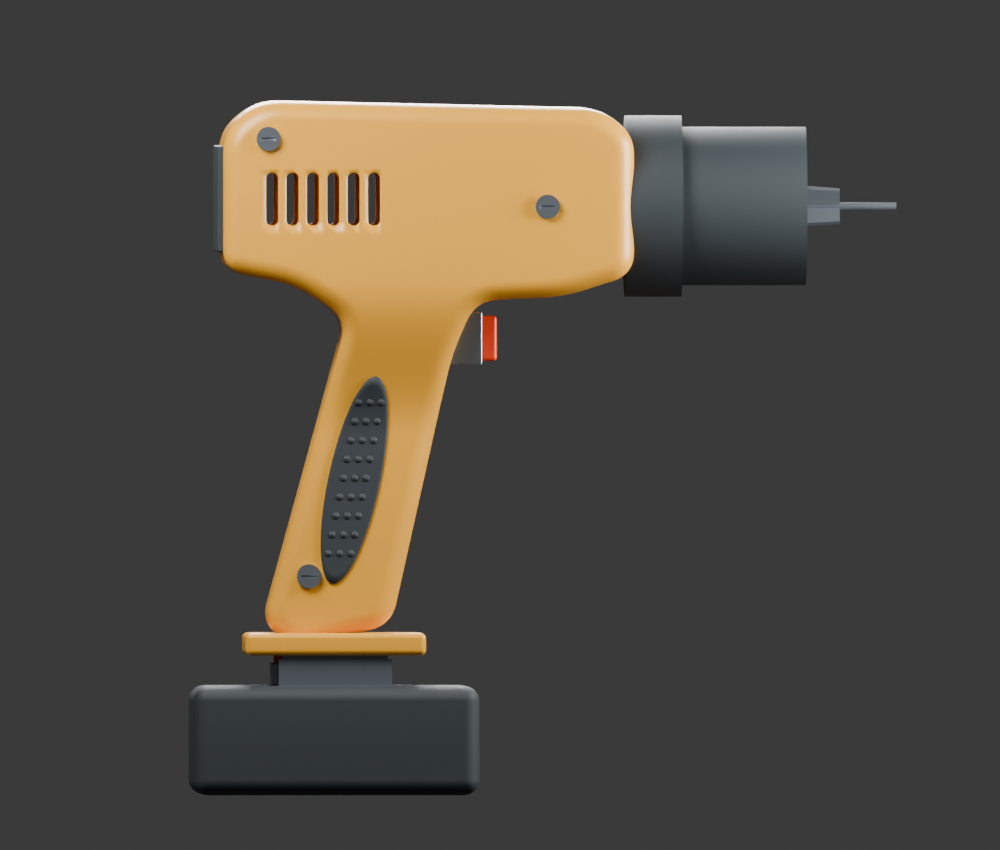
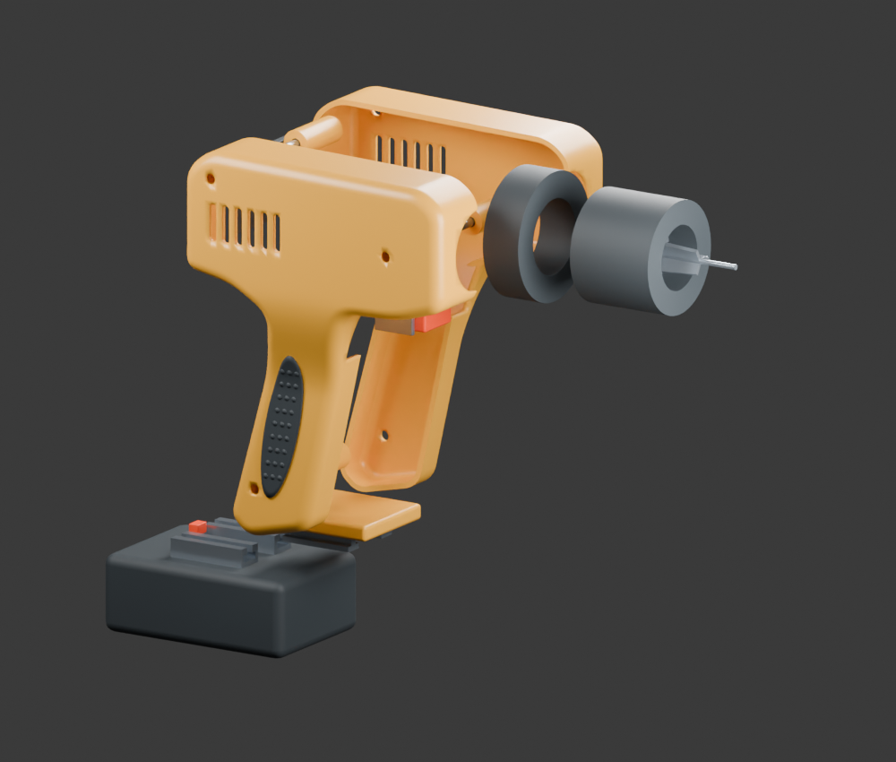
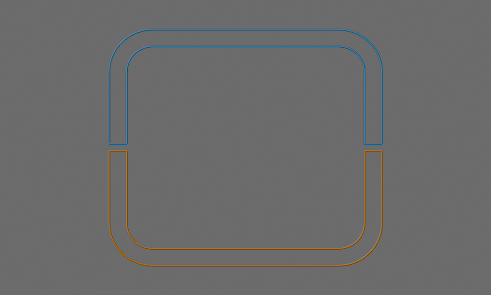
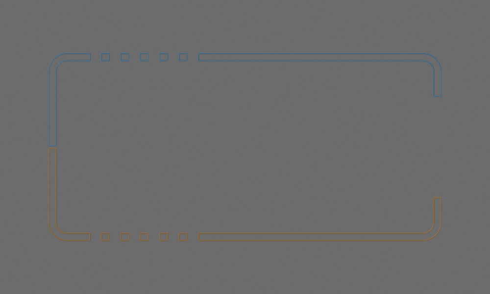
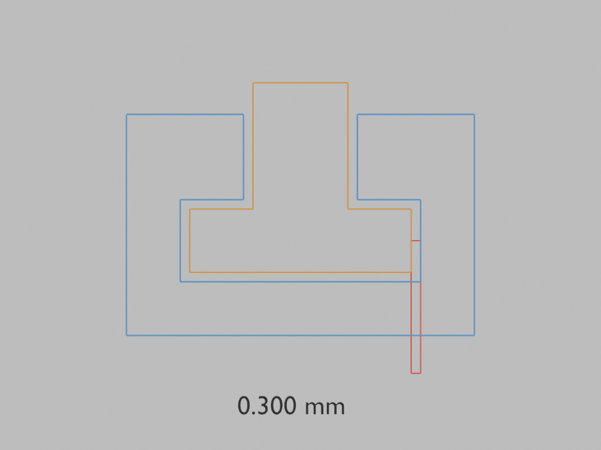
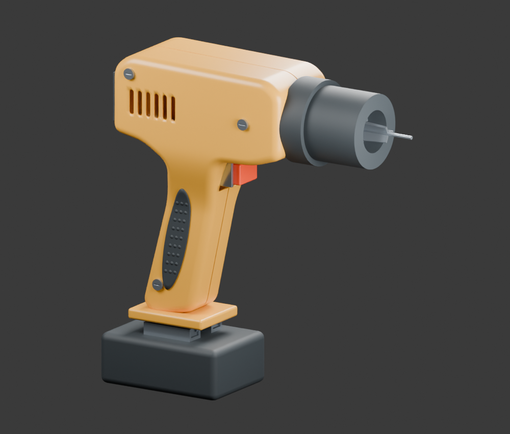
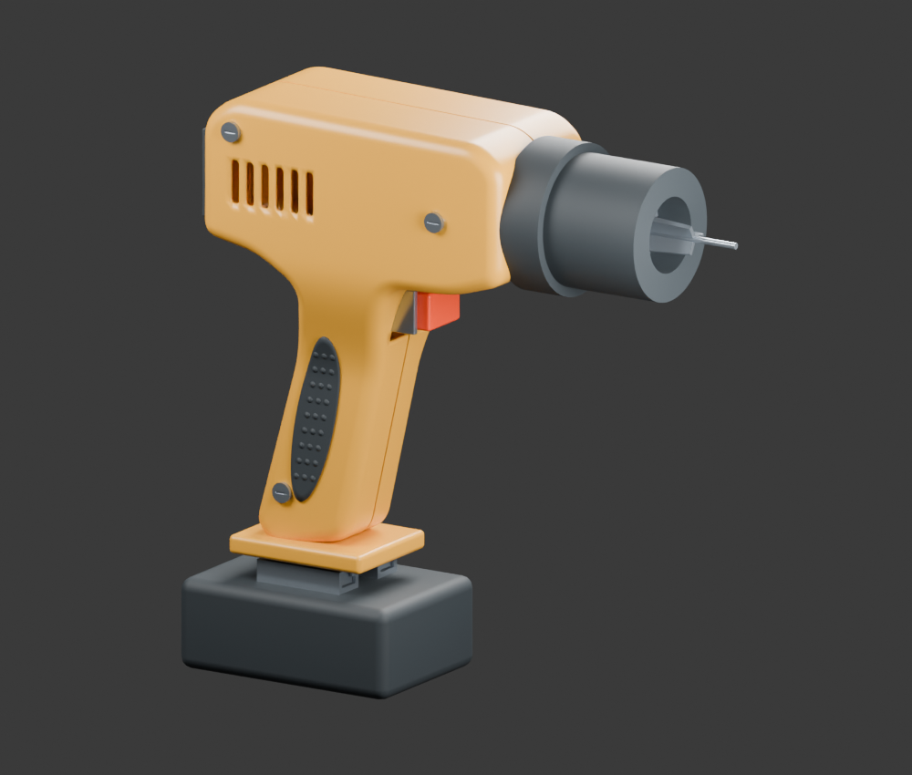
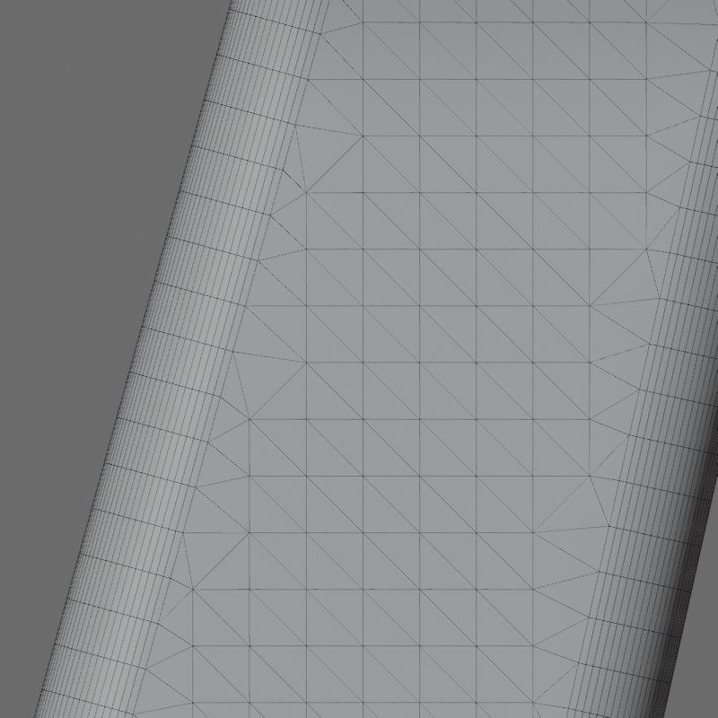
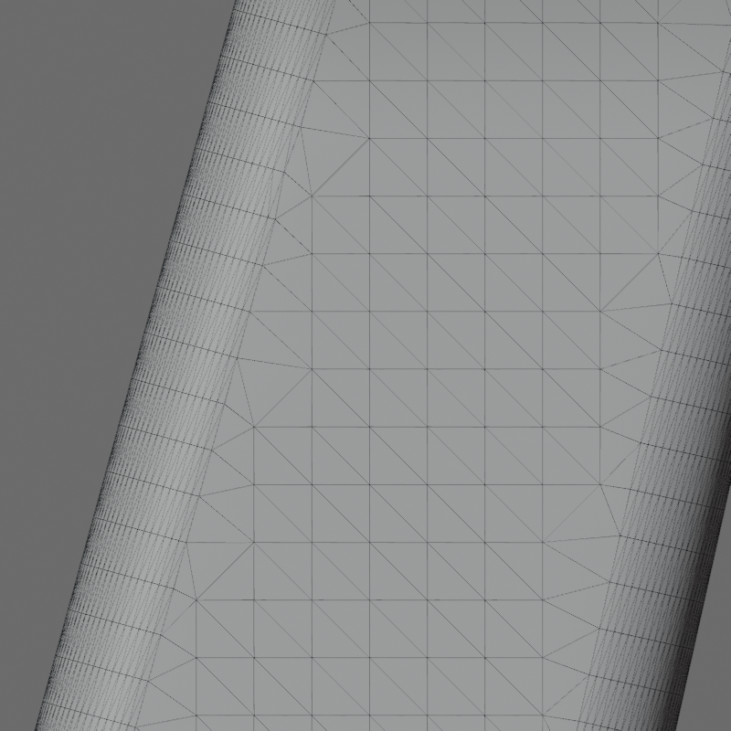

# Editable drill assembly

Completed 2026-10-07 against [M0-M5](../ROADMAP.md). The [completion audit](../audits/DRILL_ASSEMBLY_AUDIT.json) records native-file hashes, all change scenarios, measured interfaces, motion sampling, failure cases and Windows/Linux results. The [revision-4 brief](../audits/DRILL_ASSEMBLY_BRIEF.json) freezes dimensions and gates for this original authored design.

## Model and tools


The assembly contains 70 dependency nodes, 38 declared part IDs/frames and 35 visible mesh objects. A mesh object can contain multiple pattern solids; these counts are not a manufactured bill of materials. Native coordinates are millimetres.

The continuous housing/grip master produces two hollow shells, real vents and bores, projected rubber inserts and tactile dots. Separate geometry includes a hollow chuck, three radial jaws, torque ring, opposed fastening bosses/receivers and slotted screws, trigger guides/stop, captured battery rails/channels, latch and captive sleeve.

Reusable additions are continuous enclosure construction, connected semantic region selection, projected inserts with UV/mask correspondence, versioned nested dependency regeneration, explicit recipe migration and prismatic/radial motion inspection. Build, transfer, validation and commit failures restore the prior assembly. Revision 4 corrects derived frames without changing any part geometry from revision 3; migration records compare every logical part and retain earlier objects.

## Before and after

Same side-camera comparison with the preserved earlier exterior study:

| Earlier exterior drill | Editable assembly |
| --- | --- |
|  |  |



Panels are separated for inspection; this preview is not an assembly sequence simulation.

## Measured acceptance

| Check | Result |
| --- | --- |
| Baseline side silhouette IoU | 0.99987161 against independently sampled authored outline; minimum 0.985 |
| Baseline maximum section-bound error | 0.031172 mm; limit 0.1 mm |
| Baseline sampled junction normal mismatch | 0.033664 degrees; limit 5 degrees |
| Baseline follow-up wall samples | 1.998065-2.145593 mm; no missing/invalid probes; allowed 1.6-2.6 mm |
| Baseline follow-up split gap | 0.800003 mm; allowed 0.5-1.1 mm |
| Rail section overlay | Measured 0.300 mm local clearance |
| Battery at 40 mm travel | Both rail/channel pairs fully disengaged, 11 mm axial separation |
| Local remesh | 80 to 78 selected triangles, one collapse and one flip; 0.0102743 mm sampled drift; zero pinned displacement |

The outline is an authored design guide, not a photograph or manufacturer reference. High IoU measures agreement with that guide, not real-product likeness. Wall values above belong to the explicitly named follow-up file; the audit retains each scenario's measurements.

| Grip section at Z=85 mm | Housing section at Z=165 mm |
| --- | --- |
|  |  |



## Changes and persistence

All four scenarios preserve independent geometry and regenerate affected descendants: grip width +2 mm, grip length +5 mm, split displacement +1 mm and local master remeshing. All five native files reopen in separate processes, accept a further width +0.25 mm edit and preserve UVs, masks and bindings. The resulting five follow-up files also pass geometry, frame, interface and motion checks. Unknown IDs and stale attributes are rejected; an actual late-commit failure restores the baseline snapshot.

| Width +2 mm | Length +5 mm | Split +1 mm |
| --- | --- | --- |
|  |  |  |

| Before local remesh | After local remesh |
| --- | --- |
|  |  |

The remesh trial demonstrates nested propagation through a small patch. It bakes the whole source into triangles; the local 80-to-78 change is not a broad topology-quality improvement.

## Motion and regression evidence

Each of the ten native/follow-up files passes four sweeps: trigger 0-3 mm at 0.25 mm increments; latch 0-2 mm at 0.25 mm; battery 0-40 mm at 1 mm; jaw diameter 2-10 mm at 0.5 mm. Respectively, 34, 34, 150 and 99 moving/opposing pairs are checked per pose. Intentional trigger-stop and three jaw/bit contacts are recorded separately; non-contact clearance is at least 0.2 mm. All sweeps restore rest transforms.

Additional 6 mm and 10 mm bits pass. Unreleased battery movement physically collides with the foot, as well as being rejected by the interlock. Planted trigger collision, over-travel and jaw-limit failures are detected without changing saved inputs.

Windows Blender 5.2.2 LTS and [Linux Blender 4.0.2 CI](https://github.com/shakystar/mesh-workbench/actions/runs/37568855075) each pass 37 integration tests; 3 host tests pass. The actual host CLI creates and edits the assembly in native mm units. A separate out-of-range CLI recipe exits nonzero, records the failed operation, preserves its source and saves no result file.

## Reproduce

Run from the repository root with Blender on PATH. Output directories must be new; render modes may share a review directory.

```sh
blender --background --factory-startup --disable-autoexec --python-exit-code 2 --python examples/drill_assembly.py -- runs/drill-new
blender --background --factory-startup --disable-autoexec --python-exit-code 2 --python examples/drill_assembly_variants.py -- runs/drill-new/drill.blend runs/drill-width-new grip-width
blender --background --factory-startup --disable-autoexec --python-exit-code 2 --python examples/verify_drill_assembly.py -- runs/drill-new/drill.blend runs/drill-reopen-new --rollback
blender --background --factory-startup --disable-autoexec --python-exit-code 2 --python examples/drill_assembly_motion.py -- runs/drill-new/drill.blend runs/drill-motion-new
blender --background --factory-startup --disable-autoexec --python-exit-code 2 --python examples/drill_assembly_render.py -- runs/drill-new/drill.blend runs/drill-new/review
mesh-workbench run examples/drill-assembly.json --output runs/drill-assembly-cli
mesh-workbench run examples/drill-assembly-rejected.json --output runs/drill-assembly-cli-rejected
```

The last command is an expected rejection and references the preceding CLI output. Variant names also accept `grip-length`, `split-shift`, and `remesh`. Motion modes include `interfaces`, `alternate-bits` and `failures`; render modes include `sections`, `clearance` and `topology`. Check JSON pass flags, not process exit alone.

Delivered local files are `runs/drill-assembly-r4/{baseline,grip-width,grip-length,split-shift,remesh}/drill.blend` and `runs/drill-assembly-r4/reopen-{name}/followup.blend`. Generated native files/logs remain ignored; public scripts, measured evidence and previews are tracked. `verify_drill_delivery.py` inspects both groups; `audit_drill_assembly.py` refuses completion when required evidence is missing or fails.

## Boundaries

This is a sampled geometric assembly study. There is no continuous collision guarantee, motor/gearing simulation, material-strength proof, tooling design or manufacturing certification. Projected inserts reject UV/material discontinuities rather than implementing arbitrary seam-aware retopology. The toolkit remains a Python/JSON API inside Blender, not a finished interactive sculpting application.
