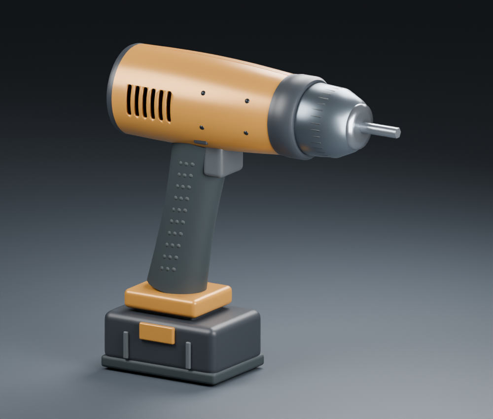
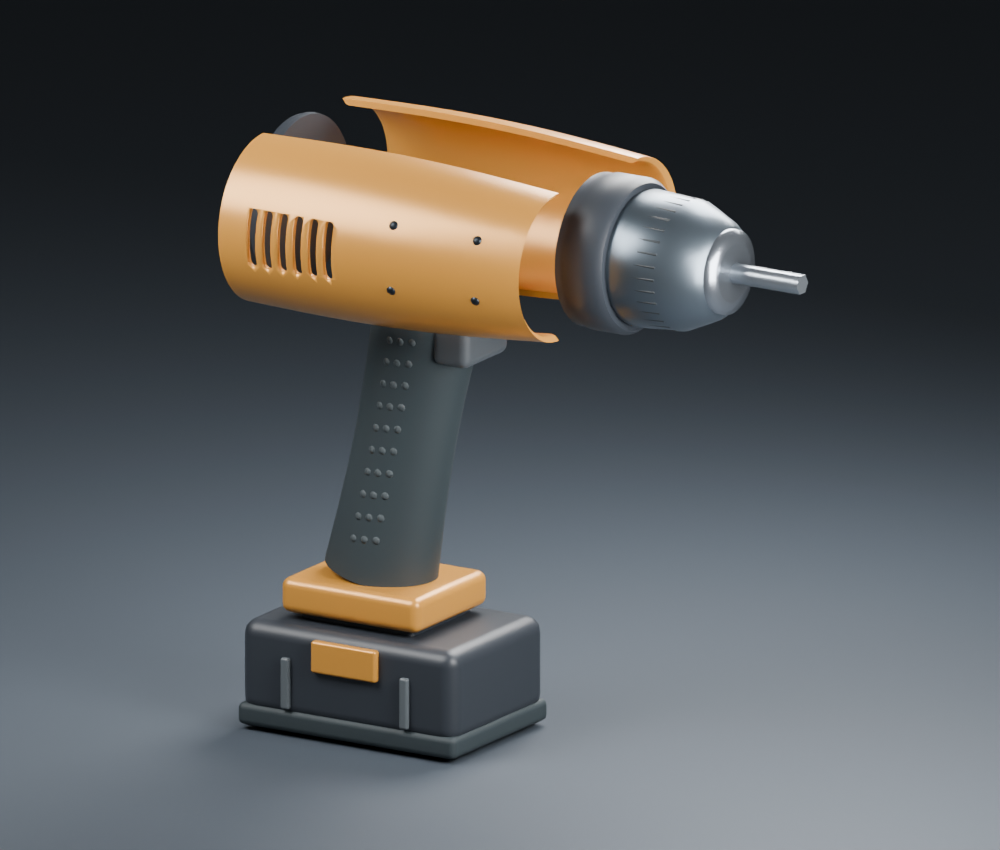
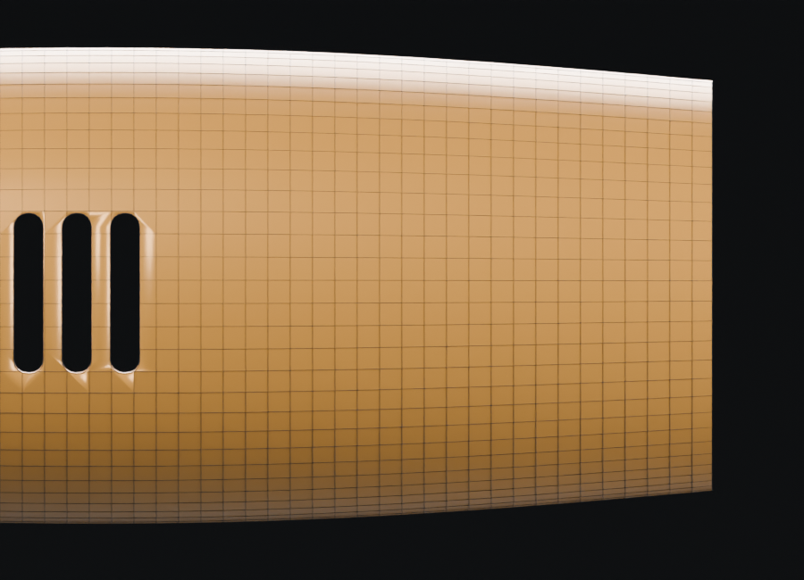
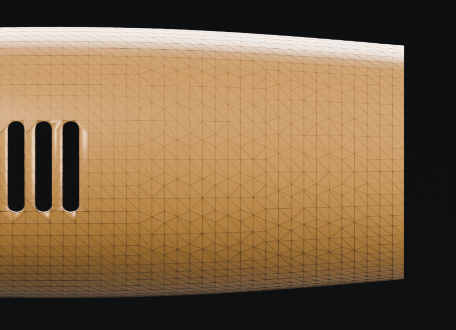

# Local remeshing and cordless drill

Native Blender study, 2026-10-06. Original authored dimensions, not a reconstruction of an external product. No generated-image assets or external model downloads. Millimetre-scale static geometry; the tools operate on mesh coordinates inside Blender.

| Assembled drill | Separated housing |
| --- | --- |
|  |  |

## Delivered milestones

1. **Local triangle remeshing:** long-edge splits, short-edge collapses with a link-condition check, and quality-improving diagonal flips. Surface boundaries, selection boundaries, sharp/seam flags, material boundaries and discontinuities in every UV layer pin their vertices. Operations stay inside connected feature charts. Input objects remain unchanged.
2. **Correspondence:** chart-constrained surface projection transfers vertex groups/masks, material slots and per-face indices, all UV layers per corner, named vertex regions and explicitly requested face/vertex selections. Barycentric surface bindings transfer with distance and normal checks. Bound relief/seam geometry can regenerate against the new mesh.
3. **Assembly transaction:** `assembly.remesh_source` forks a registered source and regenerates its directly bound relief/seam/anchor children, runs existing constraints, then switches persisted graph references. Failed staging or commit restores the graph, visibility and original object/mesh set. Old source/detail objects remain hidden for recovery after success.
4. **Actual model and follow-up editing:** a cordless drill with two closed-wall housing halves, six boolean-cut vents, chuck, bit, grip, following tactile pads, trigger and battery parts. Reopened in a fresh Blender process; UVs, masks, 2,603 fixed vertices and bindings were verified, followed by a successful assembly deformation and an independently reversible detail edit.

## Measured result

| Measurement | Before | After / limit |
| --- | ---: | ---: |
| Selected patch triangles | 1,290 | 1,078 (-16.43%) |
| Whole housing triangles | 6,374 | 6,162 |
| Whole housing vertices | 3,177 | 3,071 |
| Applied edge operations | - | 106 collapses, 60 flips |
| Fixed-vertex displacement | - | 0 mm (2,603 vertices) |
| Bidirectional sampled surface distance | - | 0.0847725 mm / 0.09 mm |
| Mean triangle quality | 0.781678 | 0.780060 |
| Four transferred anchor distances | - | maximum 0.0659695 mm |
| Fastener top clearance | - | minimum 0.0666251 mm / 0.03 mm |
| Reopened mask interpolation error | - | 2.98023e-8 |
| Reopened UV coordinate error | - | 4.77768e-8 |

The patch loses 212 triangles while meeting the shape-distance gate. Mean triangle quality decreases slightly; this is constrained simplification, not evidence of universal mesh-quality improvement. The drill run needs no split; separate irregular planar and curved-sphere tests exercise splitting and all three operations.

Distance probes include every vertex, edge midpoint and triangle centroid: 18,476 output-to-source and 19,112 source-to-output probes. This is a sampled bound, not a continuous Hausdorff guarantee. Triangle quality is `4*sqrt(3)*area / sum(squared edge lengths)`, with 1 for an equilateral triangle.

| Original polygon layout | Remeshed triangle layout |
| --- | --- |
|  |  |

Both renders use identical cameras and lighting, with only the respective housing and its wire overlay visible. The output is globally triangulated at snapshot time; only the selected chart interiors undergo edge operations. Outside-patch coordinates are preserved, but original outside polygon IDs and n-gon/quad representation are not retained.

## Geometry and saved-file evidence

- Each of six slot-center rays passes completely through the left housing; a nearby ray hits the surrounding wall. Slots are real holes, not black decals.
- All visible modeled parts have zero nonmanifold edges and zero nonadjacent triangle-overlap candidates in the recorded per-part checks. Intentional seated/intersecting parts are not a globally collision-free mechanical assembly.
- Housing construction uses a nominal 2 mm wall and 0.4 mm trim per half. These are construction settings; this study does not certify minimum wall thickness after remeshing, fastener engagement, manufacturing, motor function or ergonomics.
- Fresh-process verification compares saved coordinates to `housing.npy`, checks fixed source/output vertex pairs exactly, independently checks the linear UV field and interpolated mask values, and resolves the retained named region (544 vertices).
- An injected failed constraint leaves graph text, object/mesh sets and housing coordinates unchanged. A subsequent radial edit of -0.15 mm along Y succeeds and regenerates four fasteners; their largest anchor movement is 0.0645962 mm. The following clearance check still passes at 0.0660952 mm.
- A manual edit on a fork can be disabled to restore its coordinates. The input `.blend` hash remains unchanged throughout verification.
- Artifact: `runs/drill-study-09/drill.blend`, SHA-256 `d99ed5e940aff6bde0b7827f1c585d5b1cf791dba54f7c121c7da6f4a35f1f81`.

[Machine-readable evidence](../audits/DRILL_AUDIT.json) includes the per-part results, six vent probes, transfer/clearance results and reopened-file checks.

## Development findings retained

An initial target edge length produced no edge operations; it was not accepted as a remeshing demonstration. Six passes at the revised target exceeded the 0.09 mm distance gate and were rejected. One pass meets the unchanged gate and performs the measured collapses/flips. No geometry-error threshold was loosened to accept the result.

The first fastener geometry had only 0.03 mm nominal top clearance, insufficient at some intermediate edge samples. Its generated clearance was increased to 0.08 mm while the acceptance threshold stayed at 0.03 mm. A comparison render initially showed both housing states simultaneously; the final previews isolate the states and avoid wireframe angle spikes.

## Reproduce

Run from the checkout with Blender on PATH; output directories must be new:

```sh
blender --background --factory-startup --disable-autoexec --python-exit-code 2 --python examples/drill_study.py -- runs/drill-new
blender --background --factory-startup --disable-autoexec --python-exit-code 2 --python examples/verify_drill.py -- runs/drill-new
PYTHONPATH=src python -m mesh_workbench run examples/local-remesh.json --output runs/remesh-cli-new
blender --background --factory-startup --disable-autoexec --python-exit-code 2 --python tests/blender_tests.py
PYTHONPATH=src python -m unittest discover -s tests -p 'test_*.py'
```

`--quick` after the output path skips renders; it is useful for geometry iterations but does not produce the illustrated evidence. On PowerShell, set `$env:PYTHONPATH='src'` before host Python commands. `--blender` or `BLENDER_BIN` selects an installed Blender executable.

Windows Blender 5.2.2 LTS: 31 integration tests and 3 host tests pass. The actual host CLI recipe also completes. The latest focused run includes material/UV boundary preservation, all edge operations, transferred masks/bindings, stale correspondence rejection, failed-output cleanup, assembly rollback and structured CLI failure reporting. [Linux CI](https://github.com/shakystar/mesh-workbench/actions/runs/37398919639) on implementation `a03b8fab4928116f8fc5406cfc0643023de171ed` also passes all 31 Blender integration and 3 host tests using Blender 4.0.2. The four milestones are complete.

## Scope

This is conservative triangle remeshing, not automatic quad retopology. It does not optimize UV packing or transfer arbitrary color/custom attributes, subdivision-limit surfaces, modifiers, shape-key history or rigs. The source retains its history; the output is baked world-space geometry. Short/long-edge thresholds are heuristics, and fixed boundaries can prevent the requested target length. Convergence and globally improved triangle quality are not guaranteed.

Correspondence is a measured same-chart projection, not exact inversion. Face selection transfer classifies target centroids by the closest original triangle; vertex selection transfer requires all nonzero source support to belong to the selection. Edge selections are rejected. Geometry changes to either source or output invalidate migration provenance; existing target bindings remain valid for same-topology edits.

Assembly remeshing supports a source with **direct bound details**. Shell-partition and nested dependency correspondence is rejected before editing rather than silently retaining stale indices. Existing same-topology assembly editing remains available after remesh. General topology-changing assembly propagation and continuous collision checking remain future work.
