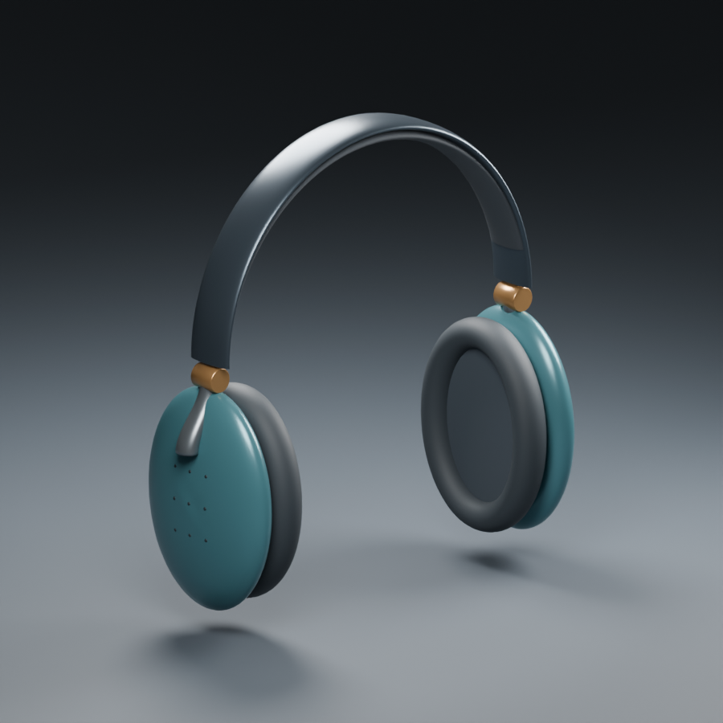
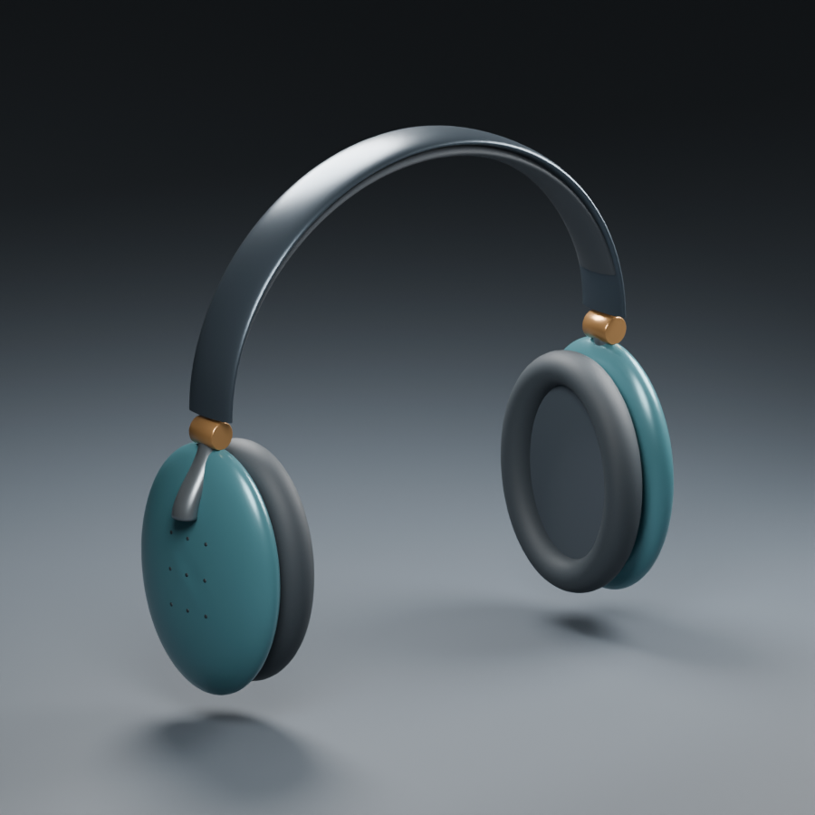
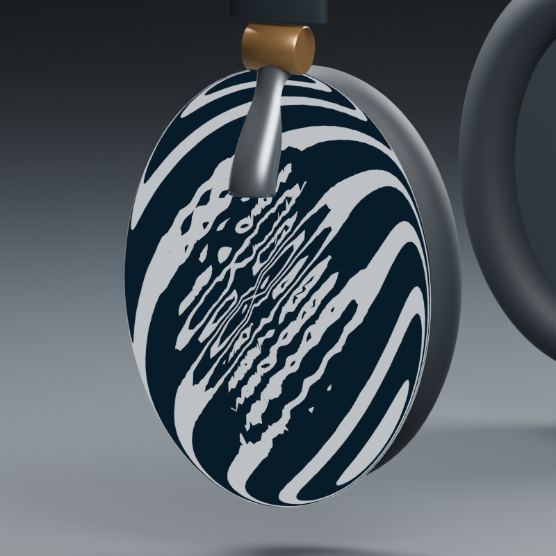
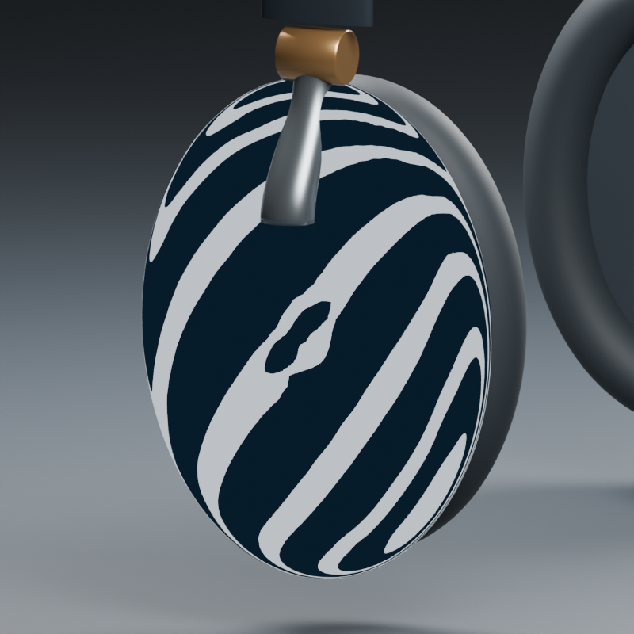
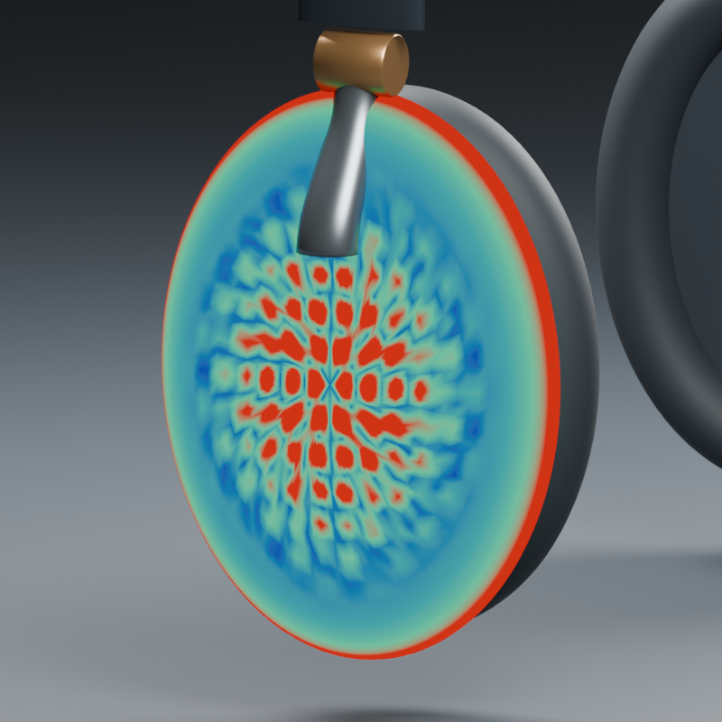
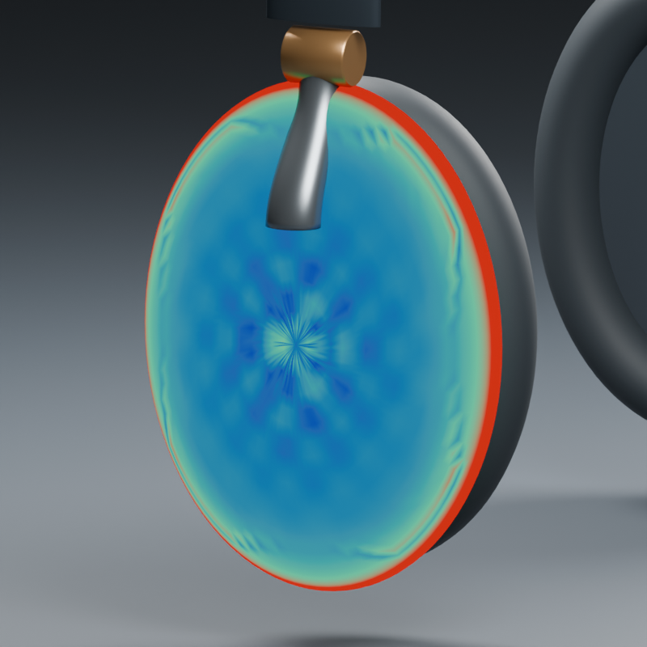

# Folding headphones: surface quality and refinement correspondence

Three native headphone designs exercise new surface-quality, boundary-pinned repair, section-preserving path, explicit refinement and group-hinge tools. The band-end spans are 156, 168 and 180 mm. The models use the same fixed cup dimensions and section sizes, with regenerated paths and hinge positions.

| Standard open | Standard folded 45 degrees |
| --- | --- |
|  |  |
| Compact, 156 mm span | Wide, 180 mm span |
|  |  |

The [dimension sheet](../assets/headphone-target.svg) and [frozen JSON brief](../../examples/headphone-target.json) are authored procedural references, not scans of an existing product. The target hash is recorded before modeling. Cups, band, cushions, Hermite yokes, hinge barrels, driver discs and nine surface inlays are actual mesh objects. Dark dots are raised cosmetic details, not through-holes.

## Six milestones

| Milestone | Evidence |
| --- | --- |
| Curvature and reflection diagnostics | Cotangent mean-curvature point data, a shared-scale color map, and actual Blender renders using a reflected-view-direction band shader. |
| Pinned surface repair and connection | Weighted local quadratic fits reduce a controlled surface defect while exactly preserving 2,961 pinned vertices. Hermite ring bridges define the yokes with explicit endpoint derivatives. |
| Section-preserving path changes | Open band paths and closed planar cushion loops retain ellipse radii; the band is rebuilt from a reference path for every span. |
| Correspondence after face subdivision | Selected evaluated triangles split into centroid fans. The source stays intact; face/vertex selections, named regions, vertex-group masks and barycentric details transfer using saved provenance. |
| Hinges and interference | Persisted rest matrices, world pivots, axes and angle limits; repeat poses are absolute, not cumulative. Simultaneous left/right folding tests 52 cross-group/fixed-part pairs. |
| Three models and reopened editing | Each native model passes fresh-process coordinate, mask, provenance, fold and follow-up sculpt/pattern/path checks without changing its saved file. |

## Surface repair

| Reflected-view bands before | After |
| --- | --- |
|  |  |
| Mean-curvature map before | After, same color scale |
|  |  |

The defect is a known sinusoidal perturbation on an authored ellipsoidal cup. This controlled benchmark lets the repair be checked against the untouched guide. It does not establish likeness to a photographed product.

- Vertex RMS distance to the clean guide: **0.226153 -> 0.054355 mm**, about **76% lower**.
- Curvature-gradient RMS on the same 1,553 movable vertices: **0.036677 -> 0.018153 mm^-2**, about **51% lower**.
- 95th-percentile mean-curvature magnitude: **0.185351 -> 0.043593 mm^-1**.
- Pinned-coordinate error: **0**. The deformation layer independently disables back to the original defective geometry.

The map uses blue at zero, green at 0.05 and red at/above 0.1 mm^-1. High curvature is not automatically a defect: the red cup perimeter is intentionally tight. Polar triangulation and residual variation remain visible. This is not a Class-A/G2 certification. Before/after diagnostics use the **same pre-refinement topology**, because discrete curvature depends on sampling. The band shader visualizes reflected view direction; it is not a physically measured striped light enclosure.

The mean-curvature implementation uses the standard cotangent Laplacian with barycentric lumped mass and the `|Delta x| / 2` convention. The geometric-operator background is described in the [libigl tutorial](https://libigl.github.io/tutorial/#curvature-directions). A radius-10 sphere regression verifies mean curvature near 0.1. The quadratic repair itself is implemented in this package; no libigl dependency is installed.

## Shape, subdivision and motion measurements

| Variant | Cup side silhouette IoU | Band front silhouette IoU | Maximum band radius error (mm) |
| --- | --- | --- | --- |
| Compact | 99.936% | 99.339% | 0.00000327 |
| Standard | 99.936% | 99.267% | 0.00000405 |
| Wide | 99.936% | 99.175% | 0.00000494 |

These two component projections do not measure whole-product three-dimensional likeness. Acceptance remains 98.5% cup IoU and 97% band IoU. The yoke bridge endpoint position error is 0.00000306 mm; its first/last tessellated segments deviate by at most 3.222 degrees from the specified analytic tangents. Arbitrary automatic surface stitching or G2 matching is not implemented.

Each refined left cup contains **7,058 vertices**. The transferred named region contains **4,197**. Saved barycentric anchor migration error is **0.00000171 mm**. Reopening verifies interpolated mask values and a maximum provenance-coordinate error of **0.00000463 mm**. An independent BVH nearest-surface check reports 0.00001387 mm against a declared float32 tolerance of 0.00006104 mm (eight ULPs at this scene scale); it is not treated as exact arithmetic.

After reopening, another 0.2 mm local sculpt moves the remapped pattern by about **0.19855 mm**. Regeneration follows the new surface, and disabling the edit restores saved cup coordinates exactly. A further band-width change preserves section radii within 0.00000541 mm.

All three designs pass a simultaneous 0-to-45-degree fold, checked at **19 poses / 2.5-degree intervals**, with no ignored interfaces and no cross-group triangle overlap candidates. Sampled minimum clearance is approximately 0.998?0.999 mm. Parts inside the same rigid group are not tested against each other; their seats intentionally meet. Per-part checks find no nonmanifold edges or nonadjacent overlap candidates in 13 visible parts. These samples do not guarantee continuous collision avoidance, full-containment detection, manufacturing feasibility, acoustics or comfort. The declared +/-60-degree limit is an input limit; only the documented 45-degree path is accepted here.

## Reproduce and inspect

```sh
blender --background --factory-startup --disable-autoexec --python-exit-code 2 --python examples/headphone_study.py -- runs/headphones
blender --background --factory-startup --disable-autoexec --python-exit-code 2 --python examples/verify_headphones.py -- runs/headphones
mesh-workbench run examples/headphone-tools.json --output runs/headphone-tools
```

Use new output directories. `--quick` skips renders and is only a geometry diagnostic. The verified native artifacts are `runs/headphone-study-06/{compact,standard,wide}/headphones.blend`. Hidden objects retain the clean guide, defective input, repaired pre-split source and diagnostic copies. Native output files are local ignored artifacts; the [public audit](../audits/HEADPHONE_AUDIT.json) records their hashes, metrics and verification.

The headphone variants currently use full procedural regeneration from the size brief, not selective mouse-assembly graph propagation. Refinement supports only the defined triangle-centroid operation. It preserves the source's piecewise planar surface within floating-point precision, not its subdivision-limit surface. Shape-key history remains on the source; the refined output is a new baked mesh. Arbitrary remeshing, UV transfer and automatic re-registration into an existing assembly graph remain outside this implementation.

Windows Blender 5.2.2 LTS: **28 integration tests and 3 host tests pass**. The actual host CLI example completes. Fresh-process verification passes for all three models. [Linux Blender 4.0.2 CI](https://github.com/shakystar/mesh-workbench/actions/runs/37325726988) passes the same 28 integration and 3 host tests on implementation commit `b1cf4aacbcdc9d7232372a266b5c443a181ff7ca`. All six milestones are complete.

Early trials are retained locally: uniform two-pass smoothing reduced positional error while making curvature variation worse, so it was rejected. Local quadratic fitting replaced it. Float64 barycentric accumulation reduced migration roundoff; BVH verification separately records its scale-dependent float32 tolerance. No user preferences or global add-ons were changed.
