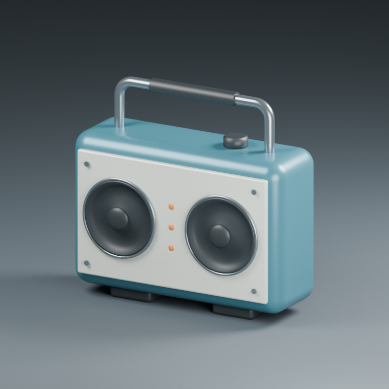
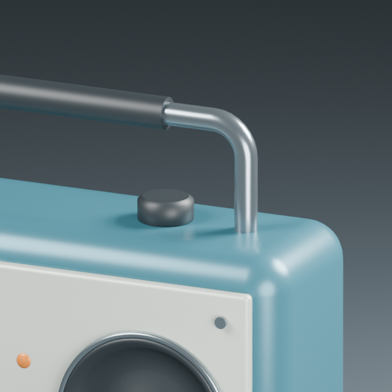
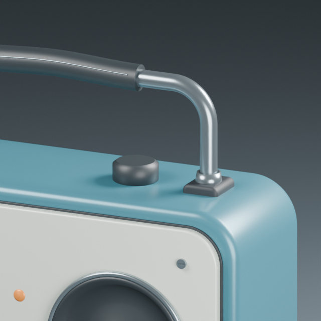
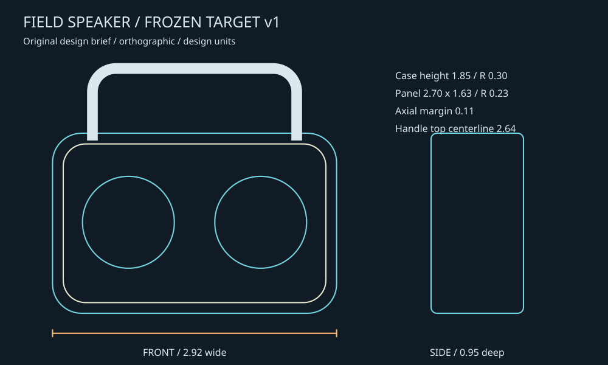
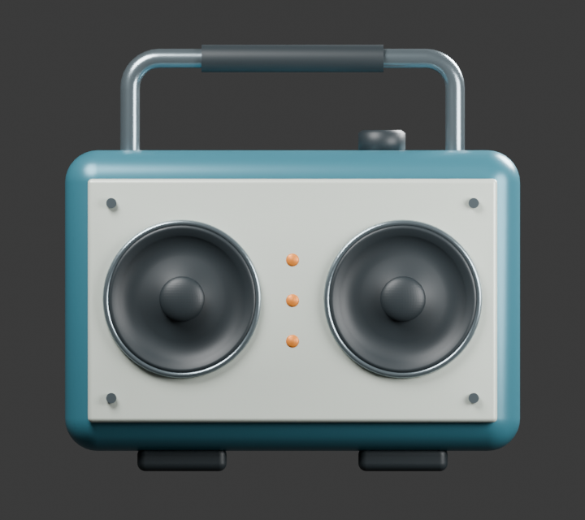
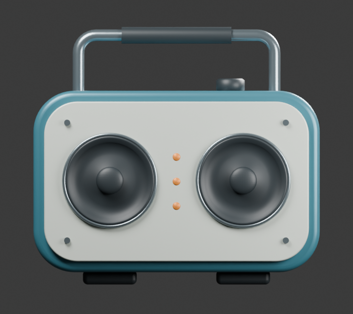
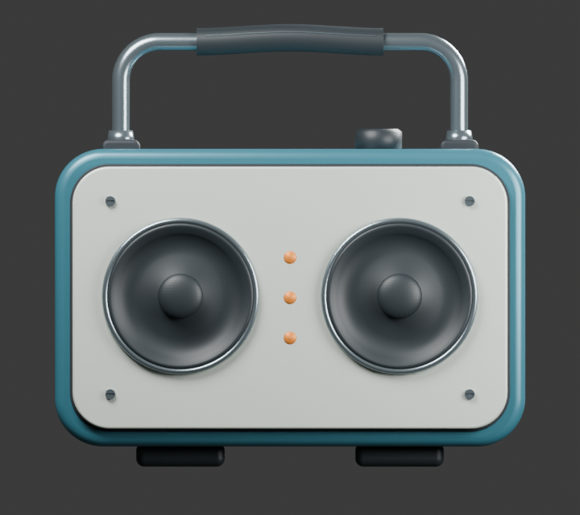

# Reference-driven speaker refinement

An original field speaker was refined against a frozen, authored design brief. This demonstrates reference measurement, named part editing, controlled curves, candidate comparison/restore and deformation-following surface details. The reference is a new design target, not an externally observed product or photograph.

| Before | After |
| --- | --- |
|  |  |
|  |  |

## Frozen target



The [target JSON](../../examples/speaker-target.json) was saved before candidate generation. Case: 2.92 x 1.85, outline radius 0.30, depth 0.95, front/back edge radius 0.06. Panel: 2.70 x 1.63, outline radius 0.23; axial margin 0.11. Handle: half-width 1.05, centerline top 2.64, two supported feet. Units are design units, with no manufacturing scale asserted.

Target hash: `e957b935cf5e1fa7a47e36515e57f7b14183db0cddef69c9fff81c6a4d21a3ed`.

## Measured results

Fixed front and side component masks, sampled at 0.005 design units per pixel. Each candidate uses the same views, target and sampling. Metrics exclude scene occlusion and measure the shell/panel independently.

| Component | Before IoU | After IoU | Before mean boundary distance | After mean boundary distance |
| --- | ---: | ---: | ---: | ---: |
| case_front | 96.498% | 99.996% | 0.020925 | 0.000023 |
| panel_front | 80.465% | 99.932% | 0.042802 | 0.000148 |
| case_side | 98.187% | 99.989% | 0.005157 | 0.000037 |

Mean of these three IoUs: **91.717% to 99.972%**. This is a silhouette metric for this authored target, not a general 3D likeness score. Acceptance requires each component IoU >= 99%, mean boundary distance <= 0.012, and no detected mesh defects. The more rounded candidate averaged 98.903% and failed the component criteria; it remains available rather than being discarded.

| Original | More rounded candidate | Final |
| --- | --- | --- |
|  |  |  |

The first run used 0.01-unit pixel-center sampling. A row of pixels coinciding with the analytic panel edge yielded 98.39% panel IoU. That run was rejected. All candidates were then remeasured at twice the linear sampling resolution with the target and acceptance thresholds unchanged. Residual deviations at the final resolution are within one pixel; exact subpixel accuracy is not asserted.

| Panel error before | Panel error after |
| --- | --- |
|  |  |

Gray: agreement; orange: excess mesh; blue: missing mesh.

## Actual geometry changes

- Independent outline/edge radii produce a thin panel with rounded corners and controlled perimeter reveal. A separate gasket provides the dark joint.
- Tangent-connected cubic sections define a wider, taller handle. Two seats and collars replace bare tube/body intersections.
- A named grip region receives a reversible smooth profile edit. Entire sampled cross sections translate together, preserving their internal dimensions. The seam is rebound through existing barycentric anchors after deformation; its original remains hidden.
- Four front screw heads are seated against the panel and contain real Boolean-cut slots.

Visual evaluation: the final perimeter follows the shell more consistently, the supports clarify handle attachment and the grip has a visible crown. The more rounded shell/panel candidate deviates from the frozen corner targets. Remaining limitations include simple knob and cone shading, solid housing construction and unverified acoustics/assembly collisions.

## Verification

Blender 5.2.2 LTS, Windows: **17 Blender integration tests and 3 host tests passed**. New tests cover shifted/reference silhouettes, clipped/empty rejection, high-resolution measurement, mixed-resolution ranking rejection, stale regions, shared-mesh rejection, untouched vertices, layer undo, seam regeneration, persistence, cubic continuity and JSON success/failure audits.

A fresh Blender process reopened the final file and verified:

- All 41 original mesh objects retain their evaluated coordinates; source-file hash is unchanged.
- All three saved reference measurements reproduce exactly.
- All 32 visible model mesh parts are finite and closed, with zero detected nonadjacent overlap candidates per object. This excludes the studio floor and does not prove inter-object clearance.
- Named grip membership and seam anchors persist. Cross-section translation error is below 2.39e-7 units; layer undo was exact in the construction run.
- The shell/panel candidate visibility transaction restores exactly; unrelated shared parts remain untouched. This transaction is scoped to shell/panel alternatives, not the whole scene.

Implementation [Linux CI passed](https://github.com/shakystar/mesh-workbench/actions/runs/37292317713) for commit `47de44d62ec37c2227ba1371c273009b07850026`.

Machine-readable evidence: [audit](../audits/PRECISION_AUDIT.json). Native local result: `runs/precision-speaker-03/refined-speaker.blend`. Generated runs are ignored by Git.

## Reproduce

```sh
mesh-workbench run examples/field-speaker.json --output runs/speaker-baseline
blender --background --factory-startup --disable-autoexec --python-exit-code 2 --python examples/precision_speaker.py -- runs/speaker-baseline/result.blend runs/speaker-precision
blender --background --factory-startup --disable-autoexec --python-exit-code 2 --python examples/verify_precision.py -- runs/speaker-baseline/result.blend runs/speaker-precision
```

See [operation reference](../reference/OPERATIONS.md#reference-driven-precision-tools). These are bounded tools for explicit modeling decisions; no automatic photograph matching, remesh correspondence, universal retopology, perspective calibration or complete collision solver is claimed.
